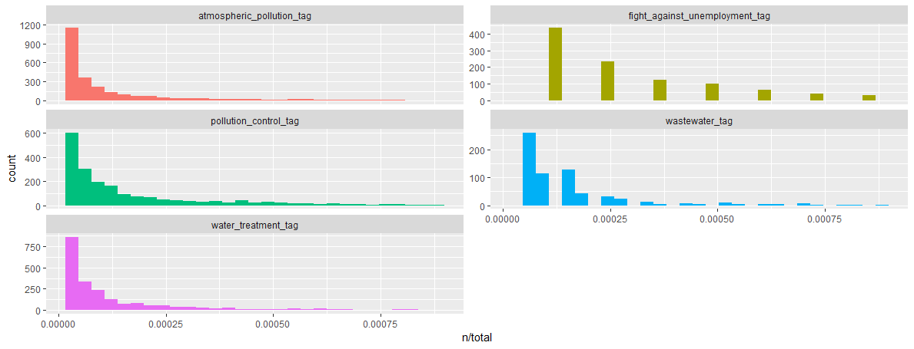
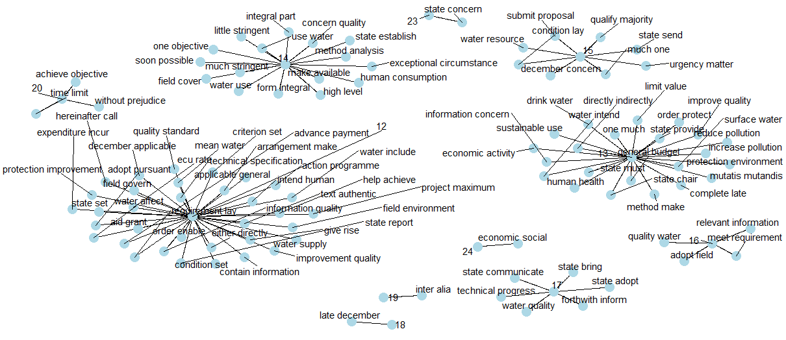

---
header-includes:
   - \usepackage{bbm}
always_allow_html: yes
output:
  html_document:
    toc: true
    toc_depth: 6
    toc_float: 
      collapsed: false
      smooth_scroll: false
    theme: united
    highlight: haddock
    css: "style.css"
    
bookdown::html_document2: default
---


&nbsp;
&nbsp;
&nbsp;
    
#Exploratory analysis

Eurlex dataset is available in several European languages, but we have done exploratory analysis for **English** language.  

#### <span class="header">Dataset</span>
The Eurlex dataset for every language comprises two files. The text content (laws/treaties) for each language is available in a file (acquis.cf). The content and the labels for each document has been stored in the file in the following way:  

- Every **odd** line consists of *label-ids* and the *document-id* of a document. The labels and document-id is separted by a *#*.  
- Every **even** line consists of the actual text.  

An example has been shown below in the diagram. On the 1st line there are two lable-ids - *3032, 525* and the document-id is *31958d1006(01)*, and the actual text is on 2nd line.

<center> ![[Fig1. Data format]](Figs/acquis.png) </center>

&nbsp;
&nbsp;
The mapping between label-id and label-name has been provided in a XML. A small snippet of the xml has been provided below.
&nbsp;

```xml
<?xml version="1.0" encoding="UTF-8" ?>
<!DOCTYPE DESCRIPTEUR SYSTEM "descripteur.dtd">
<DESCRIPTEUR LNG="EN" VERSION="4_3">
  <RECORD>
    <DESCRIPTEUR_ID>4444</DESCRIPTEUR_ID>
    <LIBELLE>abandoned land</LIBELLE>
  </RECORD>
</DESCRIPTEUR>
```

The tag *DESCRIPTEUR_ID* contains the label-id and *LIBELLE* contains the label name.
&nbsp;
&nbsp;

#### <span class="header">Features used for the task </span>  
We will be using two sets of features - term incidence and tf-idf as features, and will try to answer the research question - <span class="emphasize">"How the classifiers' performance changes with different features- one with term frequency-inverse document frequency(tf-idf), another with term incidence?" </span>   
Therefore we will have two datasets for each language- one containing term-incidence as features and the other containing tf-idf as features.  

#### <span class="header">Preprocessing </span>  

Before we start with analyzing text, we need to preprocess it. Text data contains many characters which do not convey much information, like punctuations, white spaces, stop words, etc. In English, certain words like “is”, “the” is present in every document and does not help to discriminate two documents. But again, depending on the language and the task at hand, we need to deal with such characters differently.  

<span class="sub-sub-header"> How much the preprocessing varies across languages for our task? </span>  
Preprocessing will be almost same for both languages - English and German, except for the following:

- list of stopwords
- lemmatization


Since the pre-processing is little different for different languages, we need to execute the following code, to perform the pre-processing for a particular language.

```{r language_selection, include=TRUE, eval=FALSE}

init <- function(language) {
  if (language == "english") {
  print("english chosen")
    lang <<- "english"
    fileName <<- "data/english/acquis.cf"
    tfidfArffFileName <<- "output/tfidf_EN.arff"
    incArffFileName <<- "output/inc_EN.arff"
    XMLFileName <<- "output/EN.xml"
    labelFile <<- "data/english/desc_en.xml"
  }
  else if (language == "german") {
  print("german chosen")
    lang <<- "german"
    fileName <<- "data/german/acquis_german.cf"
    tfidfArffFileName <<- "output/tfidf_DE.arff"
    incArffFileName <<- "output/inc_DE.arff"
    tfidfXMLFileName <<- "output/tfidf_DE.xml"
    XMLFileName <<- "output/DE.xml"
    labelFile <<- "data/german/desc_de.xml"
    model_file <<- "output/german-gsd-ud-2.3-181115.udpipe"
    if (!file.exists(model_file))
    {
      model <<- udpipe_download_model(language = "german", model_dir = "output/")
    } else {
      model <<- udpipe_load_model(model_file)
    }
  }
}


```

To choose the language we need to preprocess, we need to pass "english" for English text and "german" for German text in the method <span class="emphasize">init()</span>.
```{r language_selection_en, include=TRUE, eval=FALSE}
#Choosing english for preprocessing
init("english")
```

We need to preprocess two things - the actual text and the labels.

Preprocessing of actual text primarily involves- removal of language dependant stopwords, html tags, punctuations, roman numerals and lemmatization.
The lemmatization for English language could be done using the method<span class="emphasize">lemmatize_strings</span> from package *textstem*, but for German language we had to use <span class="emphasize">udpipe</span> model. Lemmatization using udpipe model needs to be done in small batches of documents, else we get a weird exception when the document size exceeds a limit, therefore we need to define the following function:  

```{r udpipe, include=TRUE, eval=FALSE}
generate_lemma_per_document <- function(content, doc_id) {
  annotated_data_table <-  udpipe_annotate(model, x = content, doc_id = doc_id,  tagger = "default", parser = "none") %>% as.data.table()
  lemma <- sapply(annotated_data_table$lemma, paste, collapse = " ")
  return(lemma)
}
```


The following method performs the preprocessing for the actual text.
```{r preprocess_text, include=TRUE, eval=FALSE}


get_clean_content <- function(content) {
clean_content <- content  %>%
replace_html(replacement = " ") %>%
{
gsub('-', '', .)
} %>%
{
gsub('[[:punct:] ]+', ' ', .)
} %>%
{
gsub("\\b[IVXLCDM]+\\b", " ", .)
} %>%
tolower()
if (lang == "english")
clean_content <- lemmatize_strings(clean_content)
else{
clean_content <- stri_trans_general(clean_content, "Latin-ASCII")
lemmata <- c()
for (index in 1:length(clean_content)) {
lemmata[index] <-
mclapply(
clean_content[[index]],
FUN = function(x)
generate_lemma_per_document(x, index)
)
}
clean_content <- sapply(lemmata, paste0, collapse = " ")
}

clean_content <- clean_content %>%
removeNumbers() %>%
removeWords(words = stopwords(lang))  %>%
replace_non_ascii(replacement = " ")  %>%
trimws()

clean_content
}
```

Since we have already selected the language using <span class="emphasize">init()</span>. The following code will load and preprocess the text.
```{r load_preprocess_text, include=TRUE, eval=FALSE}
connection <- fileName  %>% file(open = "r")
raw_text_char <- connection %>% readLines(encoding = "UTF-8")
close.connection(connection)

text_content_list <-
raw_text_char[seq (2, length(raw_text_char), 2)] %>% get_clean_content()

```
We need to preprocess labels, as label names are in different file. The dataset- "acquis.cf" file just contains label-ids. Also the label names contains certain characters like space which is inconvenient to generate MLD datasets. The following code generates clean label name.
```{r load_preprocess_label, include=TRUE, eval=FALSE}
# get clean labels
get_clean_label <- function(labels) {
  labels <- labels %>%
  { gsub("\\s|\\.|\\[|\\]|-|\\(|\\)", "_", .) } %>%
  { gsub("'", "", .) } %>%
    replace_non_ascii(replacement = " ") %>%
    tolower()  %>%
    paste("tag", sep = "_")
  
  labels
}

# gets label name from label-id using xml
get_label_name_list <- function(label_id_list) {
  desc_xml <- xmlParse(labelFile)
  
  xm_df <- data.frame(did = sapply(desc_xml["//DESCRIPTEUR_ID"], xmlValue),
  dname = sapply(desc_xml["//LIBELLE"], xmlValue))
  xm_df$dname <- get_clean_label(xm_df$dname)
  
  label_name_list <- label_id_list %>%
  lapply(function(labelsets)
  strsplit(labelsets, " ")) %>%
  sapply("[[", 1) %>%
  lapply(function(label_id_array)
    lapply(label_id_array, function(label_id)
      get_label_name(label_id, xm_df))) %>%
  lapply(function(label)
  paste(label, sep = " "))
  
label_name_list
}

class_labels_list <- raw_text_char[seq (1, length(raw_text_char),2)] %>%
strsplit("#") %>%
sapply("[[", 1) %>%
trimws() %>%
get_label_name_list()

```
#### <span class="header">Data Exploration </span>  

We generate a dataframe containing the text and the corresponding label for data exploration. Therefore each row dataframe will have the text and one label among the labelsets for the document.

```{r exploration_df, include=TRUE, eval=FALSE}
text <- character()
label <- character()	
for(index in 1:length(text_content_list)){
	temp_labelset <- unlist(class_labels_list[[index]])
	for(label_index in 1:length(temp_labelset))
	{
		text <- append(text, text_content_list[[index]])
		label <- append(label, temp_labelset[[label_index]])
	}
}

text_df <- as.data.frame(cbind(text,label), stringsAsFactors = FALSE)
```
##### <span class="header">- Wordcloud </span>  

We start exploration with wordcloud, whichis a simple yet informative way to understand textual data and perform analysis.

```{r wordcloud_all, include=TRUE, eval=FALSE}
#generate tokens and count of each word from text 
tokens <- text_df %>%
  unnest_tokens(word, text) %>%
  dplyr::count( word, sort = TRUE) %>%
  ungroup()

wordcloud(words = tokens$word, freq = tokens$n, min.freq = 1, max.words=50, random.order=FALSE, rot.per=0.35,colors=brewer.pal(8, "Dark2"),scale=c(3.5,0.25))
```
<center>

</center>
The prominent words popping in the wordcloud are all law related terms like - "regulation", "commission", which does not give us any helpful insight. Therefore we need to incorporate certain law related stopwords in our preprocessing. We remove those stopwords from our dataframe and generate the wordcloud again.

```{r wordcloud_filtered, include=TRUE, eval=FALSE}
law_stopwrds <- c("accordance","chairman","necessary","comply","reference","commission","opinion","decision","annex","refer","member","european","treaty","throughout","regulation","particular","thereof","community","committee","measure","parliament","regard","amend","procedure","administrative","procedure","publication","month","date","year","enter","force","ensure","authority","take","council","act","within","national","law","main","provision","mention","approve","certain","whereas","eea","also","apply","may","can","will","require","paragraph","subparagraph","official","journal")

tokens <- filter(!tokens$word %in% law_stopwrds)

wordcloud(words = tokens$word, freq = tokens$n, min.freq = 1, max.words=50, random.order=FALSE, rot.per=0.35,colors=brewer.pal(8, "Dark2"),scale=c(3.5,0.25))
```
<center>
  
</center>

The wordcloud generated now gives more informative insight. It seems the documents/laws are related to state more than a country. Also appearance of certain terms like "export", "import", "aid","financial", "grant", makes it appear that many documents are related to import-export and financial aids/grants.

##### <span class="header">Term frequency in the documents </span>

After getting some insight from the wordcloud we examine it further. It will be interesting to see which terms are common for different category of legal text. To get that, we need to count words for each category.

```{r tf, include=TRUE, eval=FALSE}
tokens_by_label <- text_df %>%
  unnest_tokens(word, text) %>%
  dplyr::count(label, word, sort = TRUE) %>%
  ungroup() 

total_words <- tokens_by_label %>%
  group_by(label) %>%
  summarize(total = sum(n))
  
tokens_by_label <- left_join(tokens_by_label, total_words)

tokens_by_label 
```
  

There is one row in the data frame *tokens_by_label* for each word-category combination. *n* is the number of times that word is used in that legal text category and *total* is the total words in that category. Let us have a look at the distribution of (n/total) for each document category- the number of times a word appears in a novel divided by the total number of terms in that category. Our dataset has around 8000 categories/labels , and it will be difficult to analyse over 7000 categories!Therfore, we will consider randomly 5 categories.

```{r tf_graph, include=TRUE, eval=FALSE}
tokens_by_label %>% filter(label == "water_treatment_tag" | label=="wastewater_tag" | label=="pollution_control_tag" | label=="atmospheric_pollution_tag" | label=="fight_against_unemployment_tag") %>%
    ggplot(aes(n/total, fill = label)) +
  geom_histogram(show.legend = FALSE) +
  xlim(NA, 0.0009) +
  facet_wrap(~label, ncol = 2, scales = "free_y")
```


 

We observe there are very long tails to the right for the categories prtrayed above in the picture. Distributions like those shown in Figure above are very common in any given corpus of natural language -website, books, etc, and portrays that there are many words that occur rarely and fewer words that occur frequently. We can use the term frequency dataframe to plot term frequency and examine Zipf’s law.

>> Zipf’s law states that the frequency that a word appears is inversely proportional to its rank.

```{r zipf, include=TRUE, eval=FALSE}

freq_by_rank <- tokens_by_label %>%
  group_by(label) %>%
  mutate(rank = row_number(),
         `term frequency` = n/total)

freq_by_rank %>%
  ggplot(aes(rank, `term frequency`, color = label)) +
  geom_line(size = 1.1, alpha = 0.8, show.legend = FALSE) +
  scale_x_log10() +
  scale_y_log10()

```

 

The above plot is in log-log coordinates. We can see that text in all the categories in the corpus are almost similar to each other, and that the relationship between rank and frequency does have negative slope, implying they follow Zipf Law.

##### <span class="header">Top k words </span>

It would be interesting to find out top 10 words for each category, which will give us an idea what each category of law document deals with. To find the most importants words it would make sense to use tf-idf rather than term frequency, as tf-idf finds the important words for the content of each document category by decreasing the weight for commonly used words and increasing the weight for words that are not used very much in a collection or corpus of documents.  

```{r topk_mono, include=TRUE, eval=FALSE}

tokens_by_label <- bind_tf_idf(book_words_eurlex,word, label, n)
tokens_by_label
```


&nbsp;

```{r topk_plot, include=TRUE, eval=FALSE}

tokens_by_label %>%
    filter(label == "water_treatment_tag" | label=="wastewater_tag" | label=="pollution_control_tag" | label=="atmospheric_pollution_tag" | label=="fight_against_unemployment_tag") %>%
    arrange(desc(tf_idf)) %>%
    mutate(bigram = factor(word, levels = rev(unique(word)))) %>%
    group_by(label) %>%
    top_n(10) %>%
    ungroup %>%
    ggplot(aes(word, tf_idf, fill = label)) +
    geom_col(show.legend = FALSE) +
    labs(x = NULL, y = NULL) +
    facet_wrap(~label, ncol = 2, scales = "free") +
    coord_flip()
```


&nbsp;

We can see from the Fig the word "water" appears in categories/labels - *atmospheric_pollution_tag*, *pollution_control_tag* and *wastewater_tag*, which means a lot of pollution related documents are dealing with water pollution. There are many common terms among documents *atmospheric_pollution_tag* and *pollution_control_tag* as expected. The category *fight_against_unemployment_tag* does not share any common terms with the other categories. Actually it would have been interesting if it would have happened! - which could have implied that unemployment might have resulted from pollution or water related cause.  

Sometimes bigrams are more meaningful than single words, and it would be inteersting to see how the top 10 words changes for bigrams.

##### <span class="header">Top k bigrams </span>

As generating bigrams is an expensive operation, we will consider only those labels/categories having words- water or pollution or employment. We generate the tokens in similar way, except we use we used *token = "ngrams"* and* n=2* in the method *unnest_tokens.*

```{r topk_b_plot, include=TRUE, eval=FALSE}

 bigram_tokens <- text_df %>%
  filter(grepl('water|pollution|employment', label)) %>%
  unnest_tokens(bigram, text, token = "ngrams", n = 2) %>%
  dplyr::count(label, bigram, sort = TRUE) %>%
  ungroup()
  
  total_words <- bigram_tokens %>%
  group_by(label) %>%
  summarize(total = sum(n))
		 
  bigram_tokens <- left_join(bigram_tokens, total_words)
  bigram_tokens <- bind_tf_idf(bigram_tokens,bigram, label, n)
 
  bigram_tokens %>%
    filter(label == "water_treatment_tag" | label=="wastewater_tag" | label=="pollution_control_tag" | label=="atmospheric_pollution_tag" | label=="fight_against_unemployment_tag") %>%
    arrange(desc(tf_idf)) %>%
    mutate(bigram = factor(bigram, levels = rev(unique(bigram)))) %>%
    group_by(label) %>%
    top_n(10) %>%
    ungroup %>%
    ggplot(aes(bigram, tf_idf, fill = label)) +
    geom_col(show.legend = FALSE) +
    labs(x = NULL, y = NULL) +
    facet_wrap(~label, ncol = 2, scales = "free") +
    coord_flip()
```


  
Now, we see the categories *pollution_control_tag* and *atmospheric_pollution_tag* share most of the terms. Strangely *water_treatment_tag* category does not share any common bigrams with *pollution_control_tag*, which means most of the pollution control documents might not be dealing with water. Rather the pollution control documents deal more with air pollution, as they share many bigrams. *fight_against_unemployment_tag* catgory as expected stands alone and dos not share any common bigrams with other catgories in the plot.

##### <span class="header">Word association </span>

Another way to view word connections is to treat them as a network, similar to a social network. Word networks show term association and cohesion. In a network graph, the circles are called nodes and represent individual terms, while the lines connecting the circles are called edges and represent the connections between the terms. As considering entire corpus would not make sense and also makes the visuals very dense and hard to interpret visually, considering only categories related to water and employment and plot them separately.  

The code generates word association for water related category law documents.  

```{r worda, include=TRUE, eval=FALSE}

 (bigram_graph <- bigram_tokens %>%
        separate(bigram, c("word1", "word2"), sep = " ") %>%
		 filter(!word1 %in% law_stopwrds,
               !word2 %in% law_stopwrds) %>%
		filter(grepl('water', label)) %>%
        dplyr::count(word1, word2, sort = TRUE) %>%
        unite("bigram", c(word1, word2), sep = " ") %>%
        top_n(100) %>%
        graph_from_data_frame()
)

a <- grid::arrow(type = "closed", length = unit(.15, "inches"))

ggraph(bigram_graph, layout = "fr") +
    geom_edge_link() +
    geom_node_point(color = "lightblue", size = 5) +
    geom_node_text(aes(label = name), vjust = 1, hjust = 1, repel=TRUE) +
    theme_void() 
```


We can see one cluster on the right which comprises words related to improving the quality of water and human health, and another cluster on the left related to programmes/specification/standards.


#### <span class="header">Preprocessing for mldr </span>

Until now we have taken a deep dive into text analysis, but exploratory analysis for multilabel classification problems is incomplete until we study the typical MLD datasets traits - label distribution, relationship among labels and label imbalance.


To perform the exploratory analysis over the MLD dataset traits we need to generate the dataset in the format which can read by <span class="emphasize">mldr</span> package, as discussed in section [link]. First we generate the corpus and then document term matrix each for tf-idf and incidence.

```{r dtms, include=TRUE, eval=FALSE}
#corpus of text
text_corpus <- text_corpus %>%
VectorSource()  %>%
VCorpus()

#corpus of labels just like text corpus
label_corpus <- class_labels_list %>%
 VectorSource()  %>%
 VCorpus()


# dtm matrix for tf-idf. considering words having atleast 3 letters
dtm_tfidf <- text_corpus %>%
 DocumentTermMatrix(control = list(wordLengths = c(3, Inf), weighting = function(x) weightTfIdf(x, normalize = FALSE) ,stopwords = TRUE))  %>%
removeSparseTerms(0.99) # remove sparse terms, so that sparsity is maximum 99%
dtm_tfidf <- cbind(dtm_tfidf,dtm_labels) #column bind text and labels to generate ARFF file

# gets unique words- needed for incidence matrix
uniqueWords <- function(text) {
return(paste(unique(strsplit(text, " ")[[1]]), collapse = ' '))
}

dtm_incidence <-  text_corpus %>%
tm_map( content_transformer(uniqueWords)) %>%
DocumentTermMatrix(control=list(wordLengths = c(3, Inf), weight=weightBin ,stopwords = TRUE)) %>%
removeSparseTerms(0.99)

dtm_labels <- DocumentTermMatrix(label_corpus, control=list(weight=weightTfIdf))
dtm_incidence <- cbind(dtm_incidence,dtm_labels)
```

After the document term matrices have been generated we need to generate the ARFFs and the xmls

```{r arff_gen, include=TRUE, eval=FALSE}

#generate ARFF for mldr
generate_ARFF <- function(dtm, arff_name) {
  write.arff(dtm, file = arff_name , eol = "\n")
  conn <- file(arff_name, open = "r")
  readLines(conn)  %>%
  {
    gsub("_tag' numeric", "_' {0,1}", .) # workaround to declare the labels as categorical data having value 0 or 1, in the ARFF
  }  %>%
    write(file = arff_name)
  close.connection(conn)
}


generate_ARFF(dtm_incidence, paste(incArffFileName,index,arff, sep = "")) #generate arff for incidence
generate_ARFF(dtm_tfidf, paste(tfidfArffFileName,index,arff, sep = "")) #generate arff for tfidf

#generate XML for mldr
label_names <- xmlParse(labelFile) %>% xpathApply( "//LIBELLE", xmlValue) %>% get_clean_label()
xml_root = newXMLNode("labels")
for ( i in 1:length(label_names) ){
  newXMLNode("label", attrs=c(name=label_names[i]), parent=xml_root)
}

saveXML(xml_root,file=paste(incArffFileName,".xml", sep="")) #xml for incidence
saveXML(xml_root,file=paste(tfidfArffFileName,".xml", sep="")) #xml for tfidf
```
After mldr compliant datasets are generated, they are loaded. Inspection of one of them (incidence) will be fine for further analysis, as they have same features and labels, but different values. tf-idf features will have a positive continuos value and incidence feature values will be 0 or 1 (incidence of terms).

```{r load_mldr, include=TRUE, cached=TRUE, cache.path='cache/'}
library(mldr)

eurlex <- mldr("../../output/EN")
```
#### <span class="header">Preprocessing for mldr </span>

After loading the MLD, a quick summary of its main characteristics can be obtained by means of the usual summary() function.

```{r mldr_summ, include=TRUE, cached=TRUE}

summary(eurlex)

```
As we know the value of scumble lies in the range [0,1], and A low score would denote an MLD with not much concurrence among imbalanced labels and the resampling algorithms would work better. Here we can see a scumble value of 0.4078238, which is a high score, implying there is a good amount of concurrence among imbalanced labels, making it a difficult classification problem. IRLbl value is also quite high indicating a good amount of imbalance.  

Labels' information in the MLD, including the number of times they appear, their IRLbl
and SCUMBLE measures, can be retrieved by using the labels member of the "mldr" class.

```{r mldr_label, include=TRUE, cached=TRUE}
#inspect first 20 labels
head(eurlex$labels, 20) 

```
The *mldr* package provides a plot() function specific for dealing with "mldr" objects, allowing the generation of several specific types of plots. Otherwise the exploratory analysis of MLDs would have been tedious, as most of them have thousands of attributes and labels. 

#### <span class="header">Concurrence Plot </span>

The concurrence plot caters  to the need of exploring interactions among labels, and specifically between majority and minority ones. This plot has a circular shape, with the circumference partitioned into many disjoint arcs representing labels. Each arc has length proportional to the number of instances where the label is present. These arcs are in turn divided into bands that join two of them, showing the relation between the corresponding labels. The width of each band is proportional to the number of instances in which both labels appear simultaneously. Since drawing interactions among all the labels can produce a confusing result, we have plotted for labels containing terms - water, pollution and employment.  
We can choose the labels from the mldr attribute eurlex$attributes.  

```{r mldr_sub_label, include=TRUE, cached=TRUE }
plot_labels <- grep('water|equality|employment|pollution',names(eurlex$attributes))
names(eurlex$attributes)[plot_labels]

```
We can plot the concurrence plot using the plot() using type "LC"

```{r plot_lc, include=TRUE, eval=FALSE}
plot(eurlex, type="LC", labelIndices=arr)
```

<center></center>


