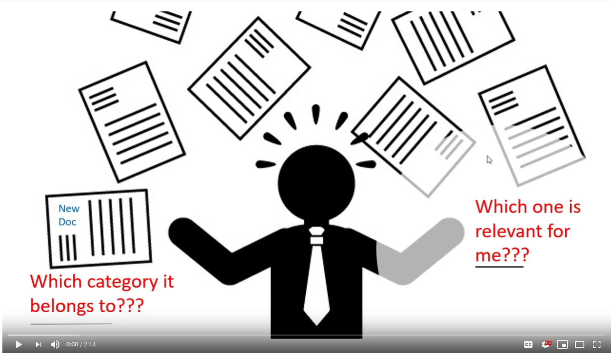

---
output:
  html_document: 
    toc: true
    toc_depth: 4
    toc_float: 
      collapsed: false
      smooth_scroll: false
    theme: united
    highlight: haddock
    css: "style.css"
    
bookdown::html_document2: default
link-citations: yes
csl: biomed-central.csl
bibliography: bibliography.bib
---


&nbsp;
&nbsp;
&nbsp;  


# Overview and motivation

A single text document often has multiple semantic aspects. A single news article related to politics may have aspects related to trade, technology and defense. Therefore, often a document needs to be tagged to multiple labels/categories, instead of a single category. Most of the classification algorithms deal with datasets which have a set of input features and only *one* output class. However, in reality the problem might be different from a typical binary or multiclass classification, as often a document or an image can be associated with multiple categories rather than a single category.

An introduction of enormous amount of documents belonging to multiple categories in the legal domain, makes it an attractive area for employing automated solutions. In this project we explore a public multi labelled legal text dataset that has been manually annotated over a decade. It contains laws related to the European Union, including treaties, legislation, case-law and legislative proposals, in 24 different languages. This is popularly known as the **EUR-Lex** dataset containing about twenty five thousand documents, around seven thousand labels and in several European languages. A skewed distribution of multiple labels per document, along with existence of the same data in multiple languages, makes this dataset an interesting proposition. Few publications have used an older version of the dataset which had around four thousand labels. The ones that have used this have reported relatively poor F1 values in the range of 40% (referred to as EUROVOC)[@LozaMencia2010] (which may be fair, given the high number of labels). There is no publications for the new dataset (having around 7000 labels), which motivates us to explore the problem of multilabel classification on this dataset. 

> **Multilable v/s Multiclass classification**  
In multi-label classification, each instance in the training set is associated with a set of labels, instead of a single label, and the task is to predict the *label-sets* of unseen instances, instead of a single label.  
There is a difference between *multi-class classification* and *multi-label classification*. In multi-class problem the classes or labels are mutually-exclusive, i.e. it makes the assumption that each instance can be assigned to only one label. E.g - an animal can be either a dog or a cat but not both. But in multi-label problem multiple labels may be assigned to an instance. E.g - a movie can belong to a comedy genre as well a detective genre.

<center>
</center>


&nbsp;

### <span class="header"> Project objectives</span>
>>Can we use machine learning techniques to automatically annotate legal documents?

To answer the question we need to answer some research questions:  

* How well the classifiers perform over Eur-Lex dataset for two languages (English and Deutsch).  
* How the classifiers' performance changes with different features- one with term frequency-inverse document frequency(tf-idf), another with term incidence.
* Which flavour of multilabel transform algorithm perform best among all, the one which considers label correlation or the one which does not.
* How the classifiers' performance changes when the number of labels is reduced (disabling the imbalanced labelsets).


## Design overview (algorithms and methods)
* Pre-processing:
     + Exclude stop words, perform lemmatization.
     + Extract features - term frequency-inverse document frequency(tf-idf) and term incidence.
     + Generate the MLD [@Gibaja:2015:TML:2737799.2716262] data format, which is needed for multi label data exploration and classification using _mldr_ [@charte2015working] and _utiml_ [@rivolliutiml] packages.
     
* Statistical exploration:
     + Basic exploration  - distribution  of attributes/labels
     + Multi-label specific exploration- labelset distribution, relationship among labels, and relationship between attributes and labels/labelsets

* Classification:  
     + Apply the classifiers (Nearest Neighbour, Random Forest, XGBoost) over the preprocessed dataset (tf-idf and term incidence) for German and English text, and for three flavours of multilabel classification methods:  
           - Binary Relevance (BR) [@godbole2004discriminative]
           - Label Powerset (LP) [@boutell2004learning]
           - Classifier Chain (CC) [@read2011classifier]
     
     + Apply the classifiers (Nearest Neighbour, Random Forest, XGBoost) over the preprocessed dataset (tf-idf and term incidence) for German and English text *for reduced labels*, and for two flavours of multilabel classification methods:  
           - Binary Relevance (BR)
           - Label Powerset (LP)

* The following evaluation measures has been used primarily to assess the multilabel predictive performance:
     + Accuracy
     + Hamming Loss
     + Micro F1
     + Macro F1
     
* Compare the performance of the state-of-the-art classifiers for:
    + Two languages (English and German)
    + Two kinds of features (tf-idf and incidence)
    + Three flavours of multilable classification algorithms (Binary Relevance, Label Powerset, Classifier Chain)
    + Reduced labels

### <span class="header">Dataset</span>
We have considered - European Union law documents (EUR-Lex).  
The [data](https://ec.europa.eu/jrc/en/language-technologies/jrc-eurovoc-indexer#Download%20JEX) in different European languages is located inside the software distributed by European Union. We have considered two languages- English and German. They can also be downloaded directly from the links below:  
- [English](https://drive.google.com/drive/folders/1F5HznSWxlZno4iVQSzsXHPhCl-cD644t?usp=sharing)  
- [German](https://drive.google.com/drive/folders/1TncK4erU2ZJc9v1_-RvwM6fDmkkUYKAk?usp=sharing)


### <span class="header">GitHub URL</span>
The [R scripts](https://github.com/suhitaghosh10/EurLexClassification/tree/master/scripts), [process notebook](https://github.com/suhitaghosh10/EurLexClassification/tree/master/reports) and other resources have been stored at the repository-  
https://github.com/suhitaghosh10/EurLexClassification.git

### <span class="header"> Screencast</span>
<div class="screencast">
[](http://www.youtube.com/watch?v=3ELi5mLlzgM"Screencast"){target="_blank"}
</div>

&nbsp;

### <span class="header"> Team</span>

- [Suhita Ghosh](https://www.linkedin.com/in/suhitaghosh/)  
- [Noor Jamaludeen](https://github.com/NOOR-JAMALUDEEN)


### <span class="header"> R packages</span>

The following packages must be installed in R-Studio.

```{r pkg, include=TRUE,eval=FALSE}

## The script installs the necessary packages if not already installed, and then loads them
packages <- c(
  "textstem",
  "stringi",
  "dplyr",
  "data.table",
  "tm",
  "textclean",
  "XML",
  "RWeka",
  "tidyr",
  "tidytext",
  "parallel",
  "mldr",
  "utiml",
  "tidytext",
  "ggplot2",
  "RColorBrewer",
  "udpipe",
  "kknn",
  "xgboost",
  "randomForest",
  "matrixStats",
  "rmarkdown",
  "wordcloud",
  "ggraph",
  "igraph",
  "tidyverse",
  "gridExtra",
  "kableExtra",
  "knitr"
)

verify.packages <- function(pkg) {
  new.pkg <- pkg[!(pkg %in% installed.packages()[, "Package"])]
  if (length(new.pkg))
    install.packages(new.pkg, dependencies = TRUE)
  sapply(pkg, library, character.only = TRUE)
}

verify.packages(packages)

```

####  <span class="sub-header"> References</span>
