---
header-includes:
   - \usepackage{bbm}
always_allow_html: yes
output:
  html_document: 
    toc: true
    toc_depth: 6
    toc_float: 
      collapsed: false
      smooth_scroll: false
    theme: united
    highlight: haddock
    css: "style.css"
    
bookdown::html_document2: default
link-citations: yes
csl: biomed-central.csl
bibliography: bibliography.bib
---


&nbsp;
&nbsp;
&nbsp;  


##Classification task
The EUR-Lex dataset contains 25K documents, which makes it impossible to train a classifier over the whole dataset. We divided the dataset into 24 subsets, each subset contains the same number of documents, we trained the classifiers over the subsets. The final evaluations results will be the average seperatly reported results for each subset. The dataset has around 7000 labels, an older version had only 4000 labels.
To observe the effect of including a large number of labels on the classification task in general, we compared the predective performance of the models when trained on a dataset with 7000 labels and when trained on a dataset with a reduced number of labels.

####<span class="sub-sub-header">Classification Models</span>
We use three methods to transform the problem of multi-label classification task into a conventional multi-class classification task: binary relevance, label powerset, classifier chain.
After transforming the classification problem, We trained three different classification models: Random Forest, k nearest neighbors, XGboosted trees. 

```{r  classifiers,echo=FALSE, warning=FALSE}

library(knitr)
library(kableExtra)

classifiermodel=matrix(NA,nrow=4,ncol=1)
colnames(classifiermodel)<-"classifier Models"
classifiermodel[1]<-"----------------------"
classifiermodel[2]<-"K nearest neighbours"
classifiermodel[4]<-"Random Forest"
classifiermodel[3]<-"XGboost"

transmodel=matrix(NA,nrow=4,ncol=1)
colnames(transmodel)<-"Transformation methods"
transmodel[1]<-"----------------------"
transmodel[2]<-"Binary relevance"
transmodel[3]<-"Classifier chain"
transmodel[4]<-"Label powerset"

kable(list(classifiermodel,transmodel)) %>%
  kable_styling(bootstrap_options = c("striped", "hover", "condensed"),full_width = F)

```

We trained nine classifaction models and compared the performance of the classifiers to produce the model that best fits the dataset and to choose the type of features to yield the best predictive performance. The following table shows the nine classifier models :
 
```{r  models, echo=FALSE}

labelpowerset=matrix(NA,nrow=1,ncol=3)
labelpowerset[1,1]<-"KNN-Label Powerset"
labelpowerset[1,2]<-"RF-Label Powerset"
labelpowerset[1,3]<-"XGboost-Label Powerset"


binaryrelevance=matrix(NA,nrow=1,ncol=3)
#colnames(mytable7)<-"Features"
binaryrelevance[1,1]<-"KNN-Binary Relevance"
binaryrelevance[1,2]<-"RF-Binary Relevance"
binaryrelevance[1,3]<-"XGboost-Binary Relevance"
#colnames(mytable8)<-list("KNN-Binary Relevance","RF-Binary Relevance","XGboost-Binary Relevance")

classifierchain=matrix(NA,nrow=1,ncol=3)
#colnames(mytable7)<-"Features"
classifierchain[1,1]<-"KNN-Classifier Chain"
classifierchain[1,2]<-"RF-Classifier Chain"
classifierchain[1,3]<-"XGboost-Classifier Chain"
#colnames(mytable9)<-list("KNN-Classifier Chain","RF-Classifier Chain","XGboost-Classifier Chain")


#kable(mytable6) %>%
#kable_styling(full_width = F)

x = kable(labelpowerset, format="html") %>%
    kable_styling(bootstrap_options = c("striped", "hover", "condensed", "responsive"))
gsub("<thead>.*</thead>", "", x)

#kable(mytable7) %>%
#kable_styling(full_width = F)


x = kable(binaryrelevance, format="html") %>%
    kable_styling(bootstrap_options = c("striped", "hover", "condensed", "responsive"))
gsub("<thead>.*</thead>", "", x)
x = kable(classifierchain, format="html") %>%
    kable_styling(bootstrap_options = c("striped", "hover", "condensed", "responsive"))
gsub("<thead>.*</thead>", "", x)


```

###<span class="sub-sub-header">Experimental settings</span> 
As mentioned earlier, the 25K documents dataset was split into 24 subsets.Each subset was split randomly into two disjointly subsets one for training and the other for testing, with the following proportions ( 65%  used for training and 35% used for testing). We trained the previously mentioned classification models separately in order to compare their performance.
We reported the results of the different models under different settings, we wanted to explore the performance of the classifiers with two types of features, with two languages and with different number of labelsets. The following table demonstrates the experimental settings:

```{r  experiments_settings ,echo=FALSE}
#install.packages("kableExtra")
library(knitr)
library(kableExtra)
language=matrix(NA,nrow=3,ncol=1)
colnames(language)<-"Language"
language[1]<-"--------"
language[2]<-"English dataset"
language[3]<-"German dataset"

feature=matrix(NA,nrow=3,ncol=1)
colnames(feature)<-"Features"
feature[1]<-"--------"
feature[2]<-"TFIDF"
feature[3]<-"incidence of terms"


labelsets=matrix(NA,nrow=3,ncol=1)
colnames(labelsets)<-"Number of Labelsets"
labelsets[1]<-"--------"
labelsets[2]<-"14517"
labelsets[3]<-"only balanced labelsets"

kable(list(language,feature,labelsets),booktabs = TRUE) %>%
kable_styling(full_width = F)


```

The following code shows the functions used for classification, we use [*utiml*](https://cran.r-project.org/web/packages/utiml/index.html) package.
To split the dataset into training and testing set we use the function [create_holdout_partition()](https://www.rdocumentation.org/packages/utiml/versions/0.1.4/topics/create_holdout_partition).The example code is showen for __binary relevance__ method. We simply change the method used into one of the following methods:
[lp()](https://rdrr.io/cran/utiml/man/lp.html) Label Powerset, [br()](https://rdrr.io/cran/utiml/man/br.html) Binary Relevance, [cc()](https://rdrr.io/cran/utiml/man/cc.html) Classifier Chain
we had to destroy the model after exporting the performance results to avoid any problematics with memory capacity using the function *rm()*
``` {r classification code, include=TRUE, eval=FALSE}

library(mldr)
library(utiml)

train_ratio <- 0.65
test_ratio <- 0.35
iteration <- 24

for(index in 1:iteration){

  ds <- mldr(paste(generic_name,index,sep = "")) %>%
  remove_attributes("...") %>%
  remove_unique_attributes() %>%
  remove_unlabeled_instances() %>%
  create_holdout_partition(c(train=train_ratio, test=test_ratio))
  
  ## KNN - K nearest neighbour
  brmodel1 <- br(ds$train, "KNN")
  prediction1 <- predict(brmodel1, ds$test)
  temp_knn <- multilabel_evaluate(ds$test, prediction1, "bipartition")

  ##remove model of memory
  rm(brmodel1)
  rm(prediction1)
  
  ## RF - Random Forest
  brmodel2 <- br(ds$train, "RF")
  prediction2 <- predict(brmodel2, ds$test)
  temp_rf <- multilabel_evaluate(ds$test, prediction2, "bipartition")

  rm(brmodel2)
  rm(prediction2)

  ## XGB - eXtreme Gradient Boosting
  brmodel3 <- br(ds$train, "XGB")
  prediction3 <- predict(brmodel3, ds$test)
  temp_xgb <- multilabel_evaluate(ds$test, prediction3, "bipartition")

  rm(brmodel3)
  rm(prediction3)
  if(index==1){
  knn <- temp_knn
  rf <- temp_rf
  xgb <- temp_xgb
  }else{
  knn <- cbind(knn,temp_knn)
  rf <- cbind(rf,temp_rf)
  xgb <- cbind(xgb, temp_xgb)
  }
  
  
```
###<span class="sub-header">Experimental Results</span>
We tested the nine models over two languages (English and German) and with two types of features (TF-IDF and the terms incidence).  
For the purpose of the evaluation task, The **mldr** package equiped us with various measurment tools, we will present all of them for each experiment, however, we chose marco F1 measurement(a measure combines between the precision and the recall) to compare the predective performance of all classifiers. Through the exploration process of the Eur-Lex dataset, the study revealed the class labels to be imbalanced (i.e some labels are frequent and some are infrequent). In that case considering accuracy is a misleading measure of the performance, instead we consider **macro F1** as a comparision factor among the classifiers.
In General, across all the experiments, we inferred that combining the label powerset transformation method with the random forest classifier produced the best performance, however, combining the label powerset with the XGBoost classifier resulted in the worst performance.

####<span class="sub-header">Dataset: English dataset</span>
For the English dataset, we observed higher macro F1 rates over all the nine trained classifiers when we used TF-IDF as the instances features. TF-IDFs are more powerful representative features than simply using the incidence of terms as features.
The expreiments show that label powerset combined with the random forest recorded the best result for the two type of features(TF-IDF and Incidence), whereas the label powerset method combined with XGB performed the worst as shown in the following figures:

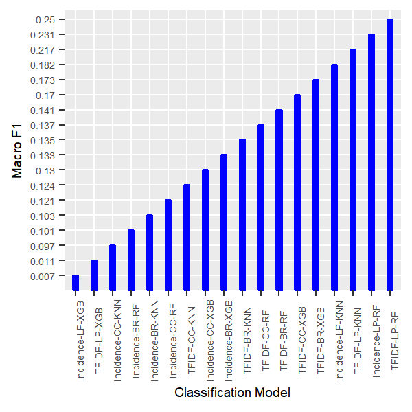


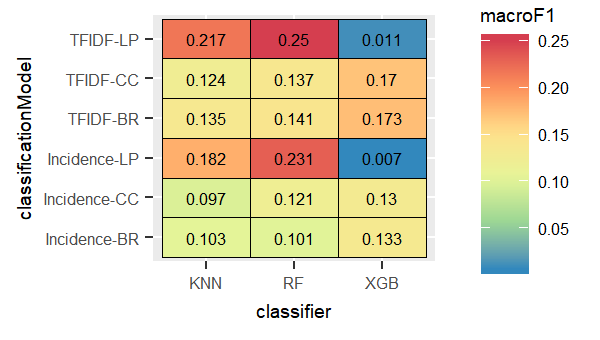

In the following sections we will display the results in detail for each feature separately. 

####<span class="sub-sub-header">Dataset: English dataset, Feature: TF-IDF</span> {.tabset  .tabset-fade}

#####Label Powerset

According to the following figures, the label powerset with the k-nearest neighbour and the random forest performed the best, however XGBoost performed the worst.


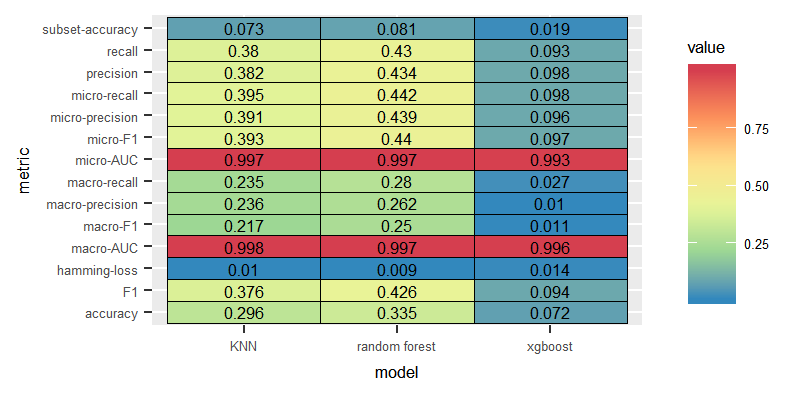

#####Binary Relevance
We compared the three models where the labels are assumed to be independent. The binary relevance method produced the best results when combined with XGBoost.

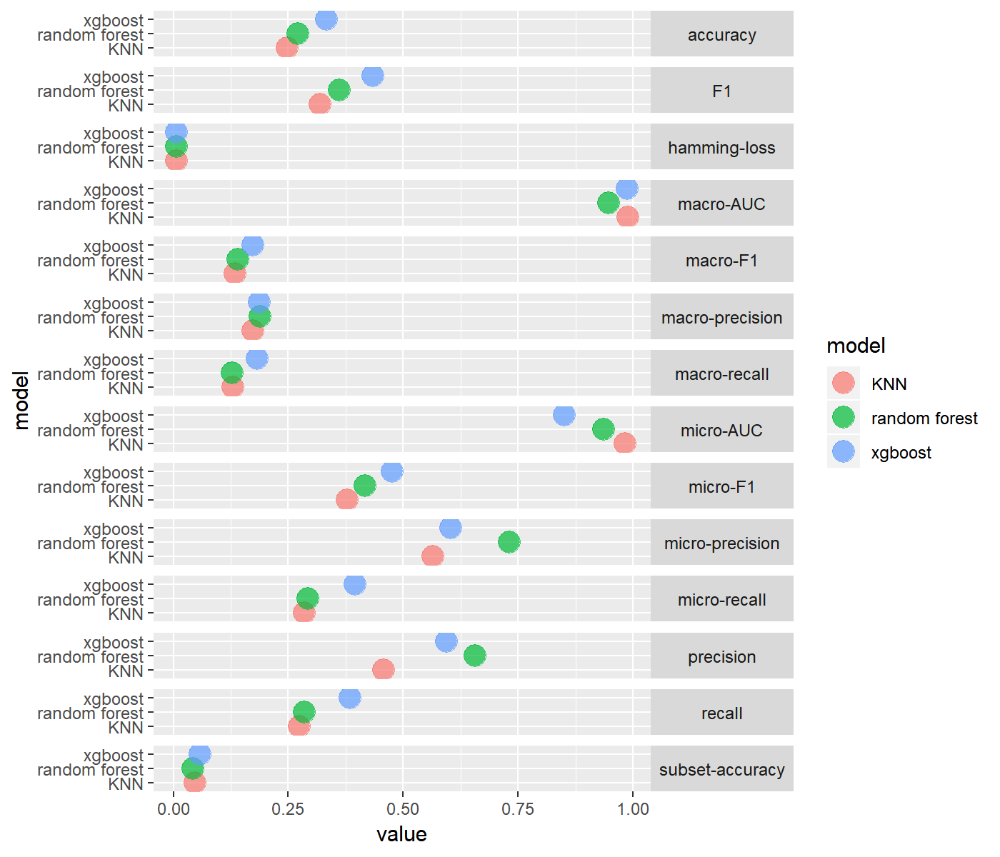 


 

#####Classifier Chain
Similar to the binary relevance method, classifier chain method performed the best with the XGBoost classifier.

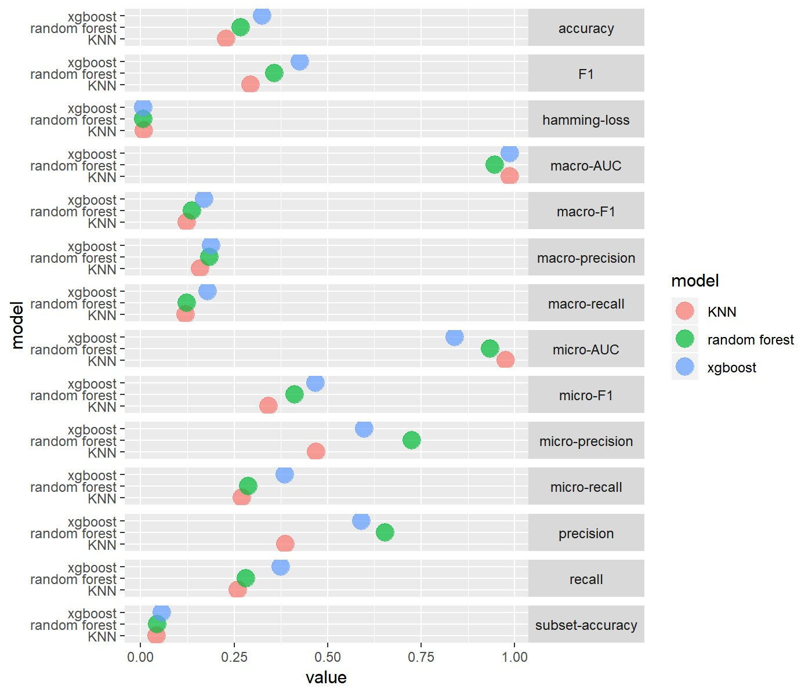 

 


#### <span class="sub-sub-header">Dataset: English dataset, Feature: Incidence of terms</span>{.tabset  .tabset-fade}
We wanted to test the performance of the models in case of employing more naive features as the incidence of terms. For English language, the experiments showed similar pattern as the case in experiments conducted for TF-IDF features, where the label powerset with the random forest classifier scored the highest macro F1 value, with the XGBoost performing the worst. Nevertheless, classifiers trained on  the incidence of terms as features did not score better than the ones trained on the TF-IDF features.

#####Label Powerset


 


#####Binary Relevance

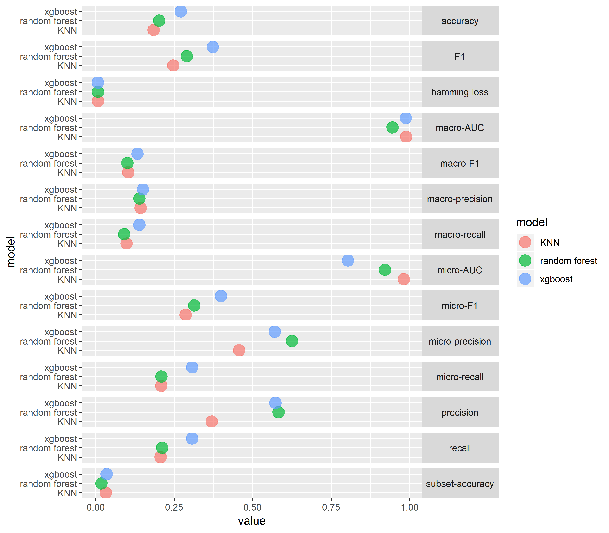

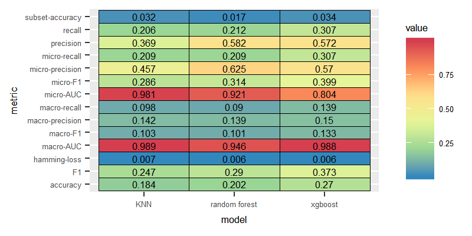 

#####Classifier Chain

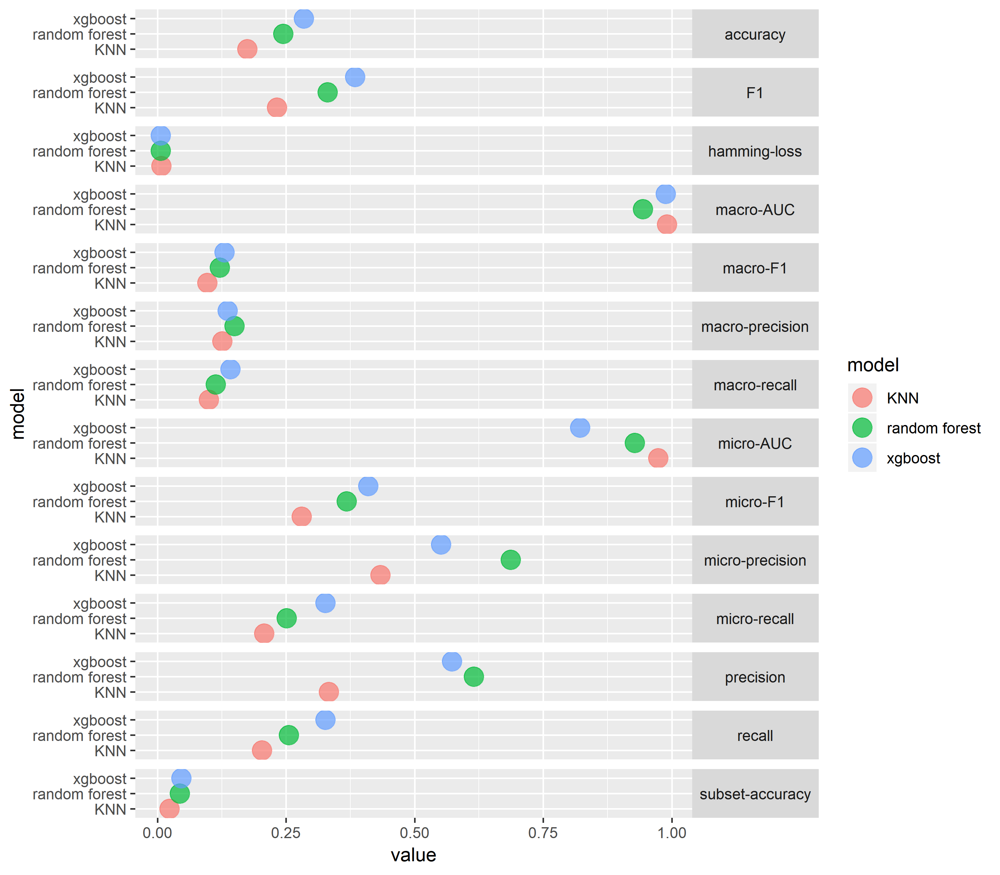

 

####<span class="sub-header">Dataset: German Dataset</span>{.tabset  .tabset-fade}
Similar to The expreiments run over the English dataset, for the German dataset the experiments show that label Powerset combined with both the random forest and the K-nearest neighbour recorded the best results for the two type of features(TF-IDF and Incidence of terms), compared to the low performance produced by the label powerset method combined with XGBoost.
On the other hand, in the contrast to the results of the the English dataset experiments,for the German dataset, we observed higher macro F1 rates over all the nine trained classifiers when we used incidences of terms instead of the TF-IDFs as the instances features. 

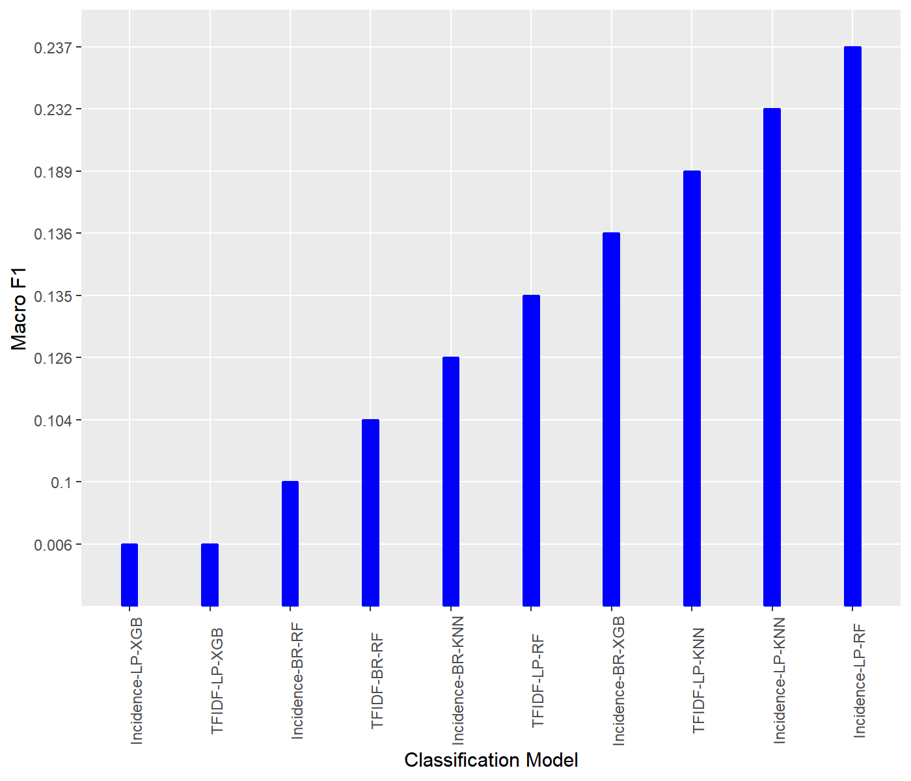


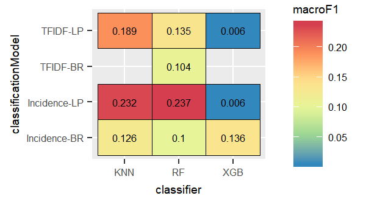

In the following sections we will display the results of the experiments run on the German dataset in detail for each type of features separately.

####<span class="sub-sub-header">Dataset: German dataset, Feature: TF-IDF</span>{.tabset  .tabset-fade}
Extracting TF-IDFs features is computentially expensive. Comparing the low performance of the classifiers to the better performance of the one trained on the incidence of terms, lead us to qualify the terms incidences as more effective features to train the classifiers on.
Unlike the English experiments, the label powerset combined with the k-nearest neighbour deliverd slightly higher performance than the classifier combining the label powerset with the random forest.

#####Label Powerset

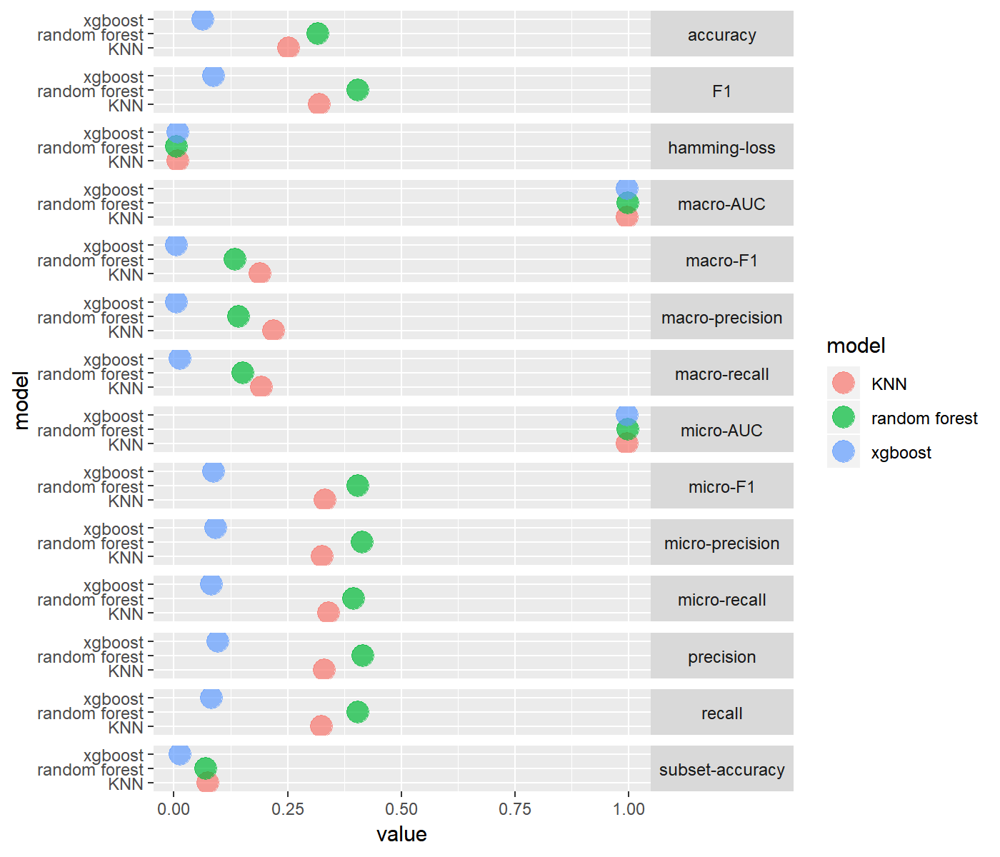


#####Binary Relevance
The performance of the binary relevance was significantly poor over the three models.


####<span class="sub-sub-header">Dataset: German dataset, Feature: Incidence of terms</span>{.tabset  .tabset-fade}
Based on the better performance deliverd when the classifiers trained on the the incidence of terms, we can consider the incidence of terms as sufficient features instead of the computentially expensive extraction of the TF-IDF features. 

#####Label Powerset

 


 


#####Binary Relevance

 


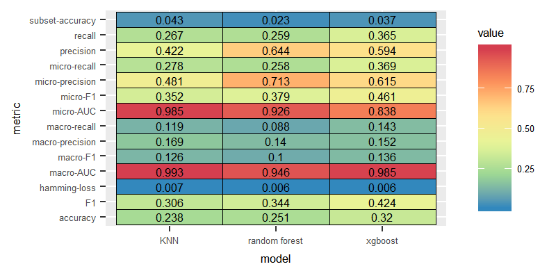

###Dataset with reduced number of labelsets
Training our classification models on a dataset with such a large number of labels(7000 labels) was a challenging task.
we expected that reducing the number of labels would improve the predective capacity of the classifiers.
To reduce the large number of labels, we take advangtage of the "scumble" measure provided by the **mldr** package. Scumble measure indicates the concurrence level among frequent and infrequent labels in the same labelsets.
we simply removed imbalanced labelsets(i.e imbalanced labelsets are labelsets with frequent and infrequent labels) and kept only balanced labelsets by filtering only labelsets with lower level of scumble values than the mean scumble value of the dataset with the following command line:

``` {r  include=TRUE, eval=FALSE}
datasetWithBalancedLabelsets <- dataset[.SCUMBLE <= dataset$measures$scumble]

``` 


####<span class="sub-header">Dataset: English dataset, balanced labelsets</span>
Generaly, pruning the labelsets through removing imbalanced labelsets improved the performance. Some classifiers scored higher than the highest macro F1 value scored in the case of keeping imbalanced labelsets. Although employing the TF-IDF features yielded in higher macro F1 for classifiers trained on the complete set of labels, in the case of balanced labelsets, classifiers trained on the incidence of terms showed slightly better performance as shown in the following graphs:


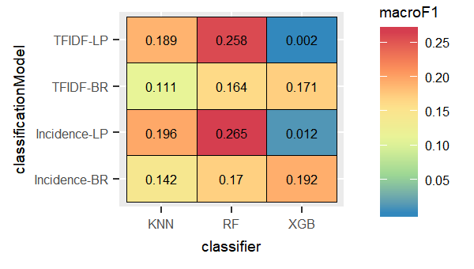

####<span class="sub-sub-header"> Dataset: English dataset, Feature: TF-IDF, balanced labelsets</span>{.tabset  .tabset-fade}
For the TF-IDFs features, most of the classifiers trained on the balanced labelsets maintained almost similar levels of performance compared to the performace with the complete set of labels.

#####Label Powerset

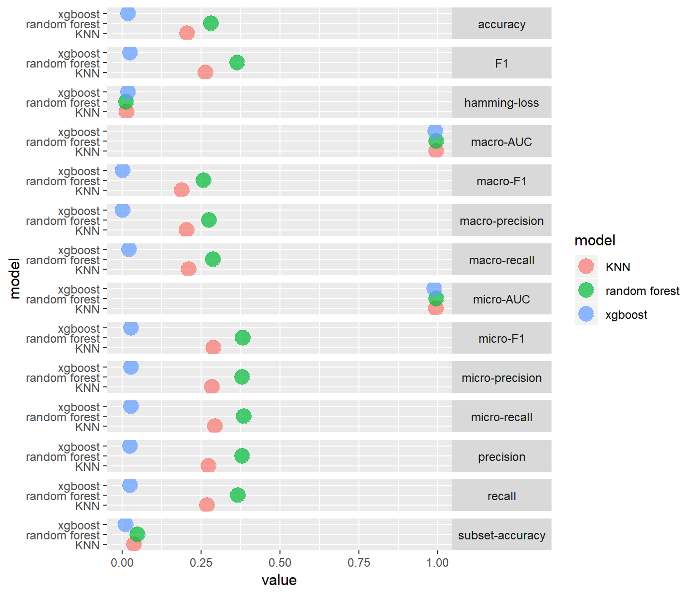


#####Binary Relevance


####<span class="sub-sub-header">Dataset: English dataset, Feature: Incidence of terms, balanced labelsets</span> {.tabset .tabset-fade}
For balanced labelsets, we observed better performance for the incidence features for all classifiers compared to the performance with the complete labelsets. The label powerset combined with the random forest classifier outperformed the performance of the same classification model trained on the complete set with the TF-IDF features. We consider incidences of terms as sufficient features even for the English dataset in case of removing imbalanced labelsets.  

#####Label Powerset 

 
 
 
 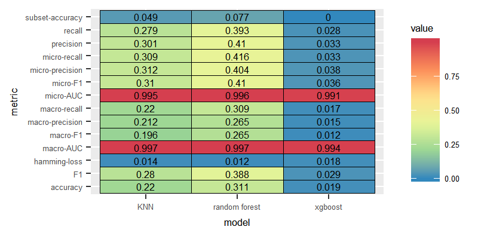
 
 

#####Binary Relevance

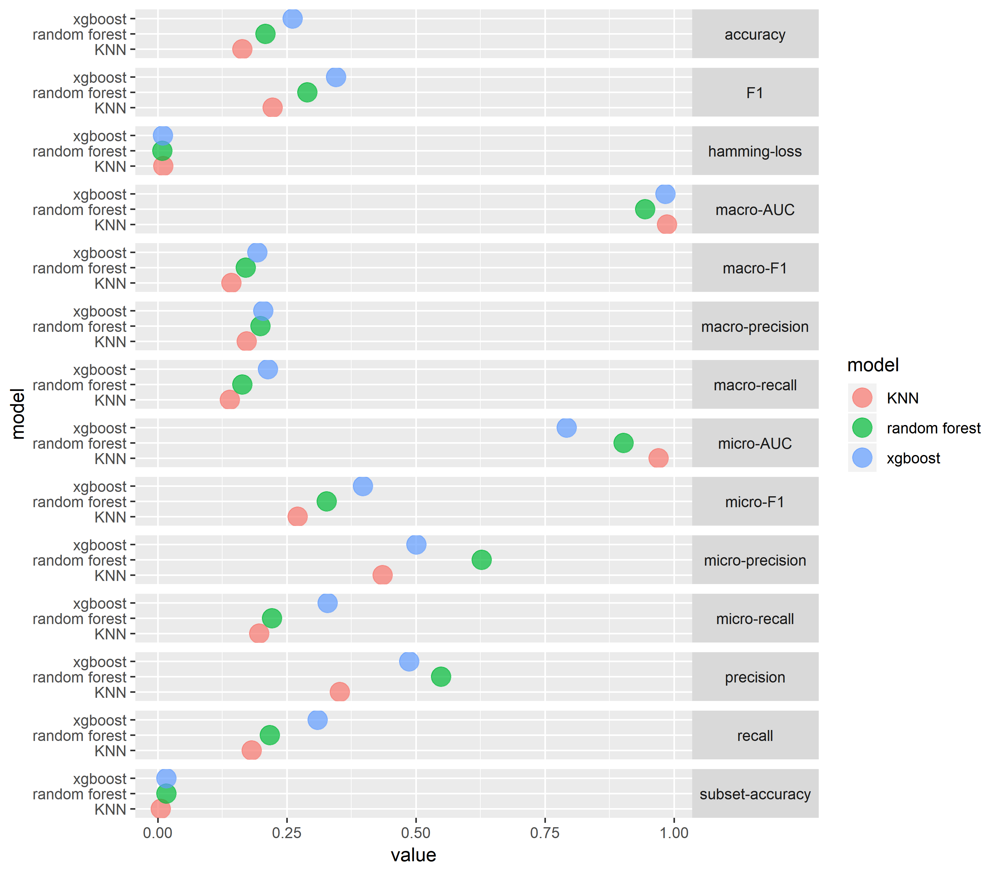
 


####<span class="sub-sub-header">Dataset: German dataset, balanced labelsets</span>


####<span class="sub-sub-header">Dataset: German dataset, Feature: TF-IDF, balanced labelsets</span>
In the case of removing imbalanced labelsets, the macro F1 value of  the label powerset with the random forest classifier increased by around(15%).

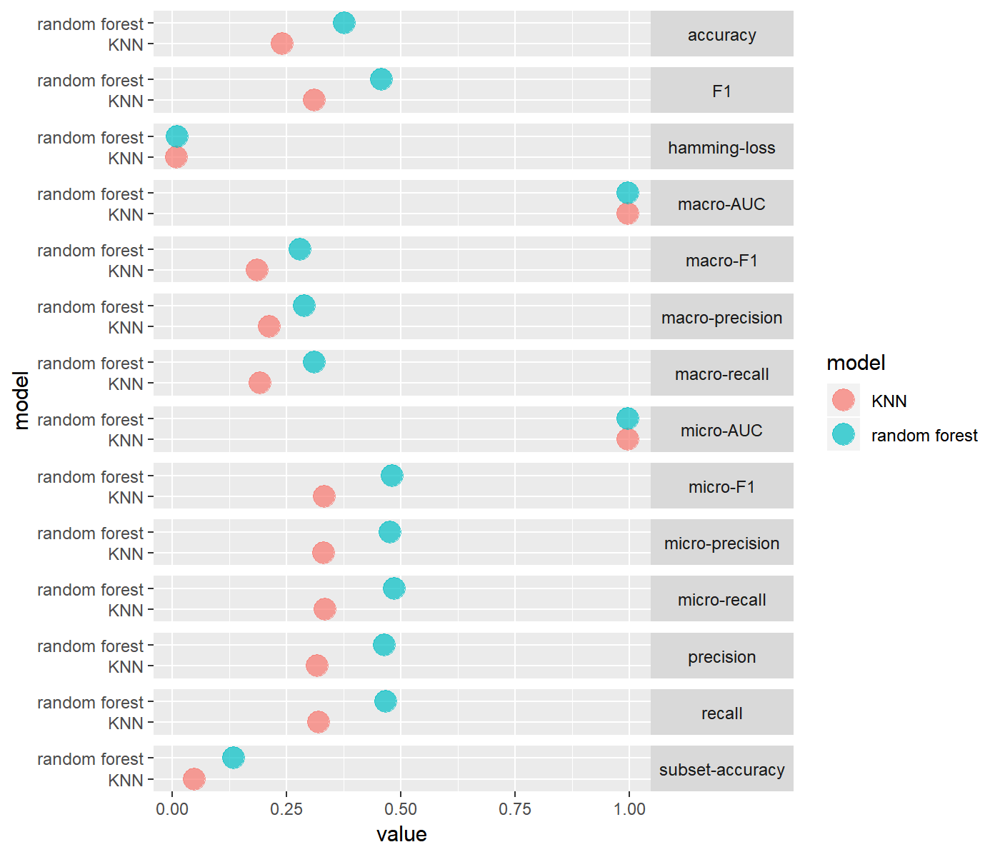


####<span class="sub-sub-header">Dataset: German dataset, Feature: Incidence of terms, balanced labelsets</span>

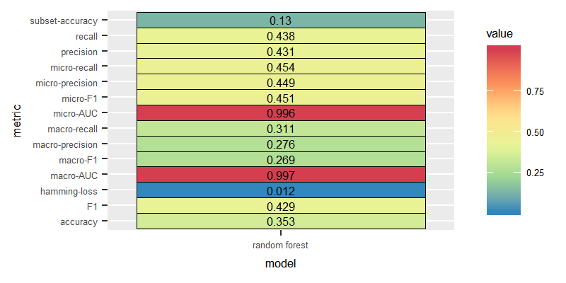


###<span class="sub-header">Conclusion</span>

>>We can conclude for both English and German dataset,the best performance was deliverd by the LP transform combined with the Random Forest classifier after removing imbalanced labelsets through exploiting the scumble measure and trained on the terms incidence in order to gain the highest macro F1 values.

- Based on the results of various experiments that we conducted on the different classification models, the best performance was observed for the combination <span class="emphasize">LP transform with Random Forest</span> and <span class="emphasize">LP transform with  K-nearest neighbour</span>, compared to BR transform along with the same classifiers .

- As mentioned earlier, LP transform takes into consideration the correlation among the labels. In contrast, the BR transform assumes the labels to be independent and ignores any dependency among labels. We infer that the assumption of the independency of labels does not hold in the case of the EUR-Lex dataset.

- Contrary to the LP method,the BR considers the labels themself. It reduces the number of labels when applying the BR to build an independent classifier for each label, which improves the perfomance of the XGBoost classifier by the model optimization technique the XGB follows.

- In experiments over the BR transformation method, XGBoost performed better than the Random Forest and the k-nearest neighbour classifiers. We surmise, since XGBoost classifier is an ensemble model uses "Boosting" as a deliberate ensemble technique, whereas Random Forest employs "Bagging" as an ensemble technique and KNN encounters the curse of dimensionality.

- CC transform method delivered poor performance across all classication models(k-nearest neighbour, Random Forest, XGBoost).

- XGBoost performed the best with CC, due to the boosting optimization technique the xgboost based on.

- Suprisingly, we found the classifiers trained on the *terms incidence* features performed better than when trained on the *tf-idf* features. we think that the occurance of the term in a document was a sufficient distinctive feature of the documents of the legal EUR-Lex dataset.

- With reduced labels we found that the classifiers overall performed better, though not much, for both English and German dataset.


