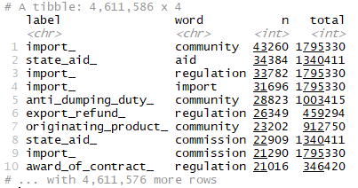
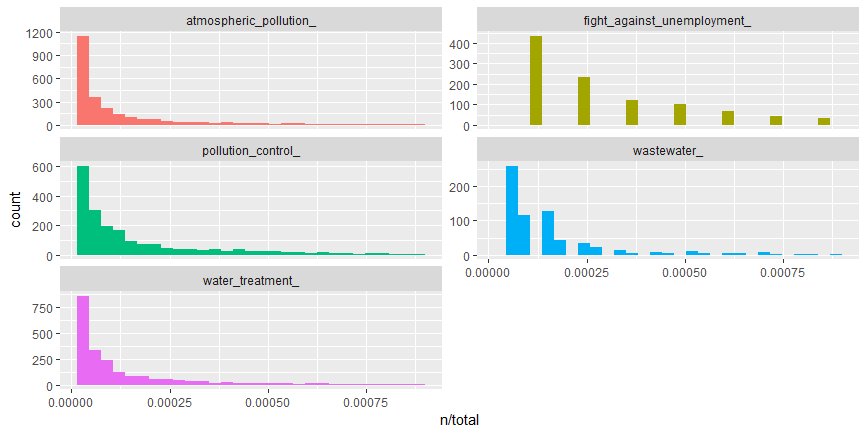
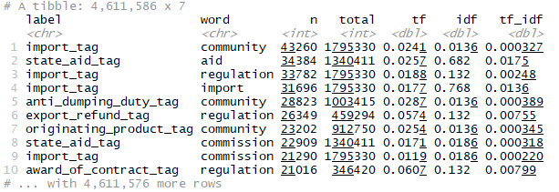
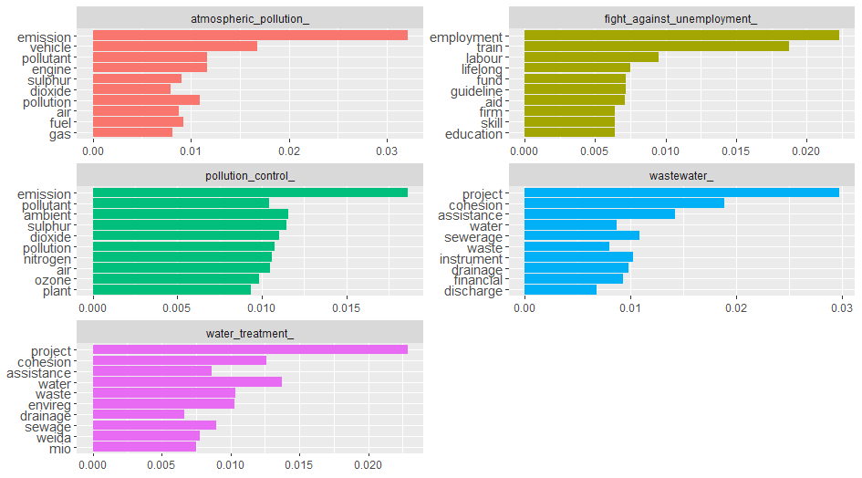
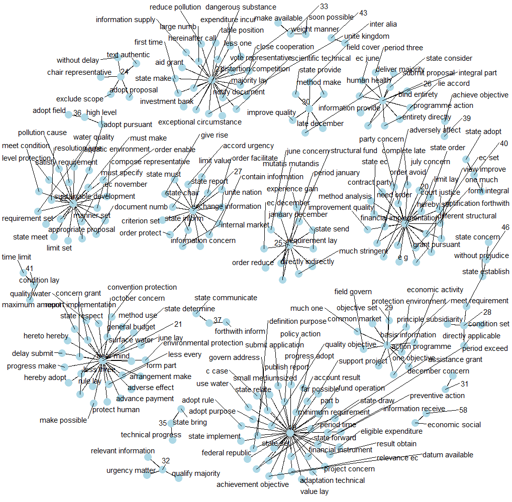

---
header-includes:
   - \usepackage{bbm}
always_allow_html: yes
output:
  html_document:
    toc: true
    toc_depth: 6
    toc_float: 
      collapsed: false
      smooth_scroll: false
    theme: united
    highlight: haddock
    css: "style.css"
    
bookdown::html_document2: default
---


&nbsp;
&nbsp;
&nbsp;
    
#Exploratory analysis

Eurlex dataset is available in several European languages, but we have done exploratory analysis for **English** language.  

#### <span class="header">Dataset</span>
The Eurlex dataset for every language comprises two files- a <span class="emphasize>"*cf*</span> file and a <span class="emphasize>*XML*</span> file.  
The documents(laws/treaties) and the document categories/labels is available in the cf file (acquis.cf). The content and the labels for each document has been stored in the file in the following way:  

- Every **odd** line consists of *label-ids* and the *document-id* of a document. The labels and document-id is separted by a *#*.  
- Every **even** line consists of the actual text.  

An example has been shown below in the diagram. On the 1st line there are two lable-ids - *3032, 525* and the document-id is *31958d1006(01)*, and the actual text is on 2nd line.

<center> ![[Fig1. Data format]](Figs/acquis.png) </center>

&nbsp;
&nbsp;

The mapping between label-id and label-name has been provided in a XML. A small snippet of the xml has been provided below.

```xml
<?xml version="1.0" encoding="UTF-8" ?>
<!DOCTYPE DESCRIPTEUR SYSTEM "descripteur.dtd">
<DESCRIPTEUR LNG="EN" VERSION="4_3">
  <RECORD>
    <DESCRIPTEUR_ID>4444</DESCRIPTEUR_ID>
    <LIBELLE>abandoned land</LIBELLE>
  </RECORD>
</DESCRIPTEUR>
```

The tag *DESCRIPTEUR_ID* contains the label-id and *LIBELLE* contains the label name.
&nbsp;
&nbsp;


#### <span class="header">Text Preprocessing </span>  

For our task two kinds of  preprocessing is needed:

- <span class="sub-sub-header">Text preprocessing</span>    
Text data contains many characters which do not convey much information, like punctuations, white spaces, stop words, etc. In English, certain words like “is”, “the” is present in every document and does not help to discriminate two documents. But again, depending on the language and the task at hand, we need to deal with such characters differently.

- <span class="sub-sub-header">Preprocessing to generate the data expected by *mldr*</span>    
To study the MLD datasets traits (label distribution, relationship among labels and label imbalance) and perform classification over MLD datasets we need to transform the available dataset into mldr format - a sparse ARFF file containing features and labels , and a XML file containing the label information.

<span class="sub-sub-header"> How much the preprocessing varies across languages for our task? </span>  
Preprocessing will be almost same for both languages - English and German, except for the following:

- list of stopwords
- lemmatization - The lemmatization for English language could be done using the method <span class="emphasize">lemmatize_strings</span> from package *textstem*, but for German language we had to use <span class="emphasize">udpipe</span> model. 

<span class="sub-sub-header"> Features used for the task </span>  
We will be using two sets of features - term incidence and tf-idf as features, and will try to answer the research question - <span class="emphasize">"How the classifiers' performance changes with different features- one with term frequency-inverse document frequency(tf-idf), another with term incidence?" </span>   
Therefore we will have two datasets/ARFFs for each language- one containing term-incidence as features and the other containing tf-idf as features.  


Since the pre-processing is little different for different languages, we need to execute the following code, to perform the pre-processing for a particular language.

```{r language_selection, include=TRUE, eval=TRUE}
library(dplyr)
library(udpipe)

init <- function(language) {
  if (language == "english") {
  print("english chosen")
    lang <<- "english" # language chosen - english
    fileName <<- "../data/english/acquis.cf" # name of the file containing data (english)
    tfidfFileName <<- "../output/tfidf_EN" # name of tf-idf arff file (english)
    incFileName <<- "../output/inc_EN" # name of term incidence arff file (english)
    labelFile <<- "../data/english/desc_en.xml" # name of the label xml file (english)
  }
  else if (language == "german") {
  print("german chosen")
    lang <<- "german" # language chosen - german  
    fileName <<- "../data/german/acquis_german.cf" # name of the file containing data (german)
    tfidfFileName <<- "../output/tfidf_DE" # name of tf-idf arff file (german)
    incFileName <<- "../output/inc_DE" # name of term incidence arff file (german)
    labelFile <<- "../data/german/desc_de.xml" # name of the label xml file (german)
    model_file <<- "../output/german-gsd-ud-2.3-181115.udpipe" # udpipe german model for lemmatization
    if (!file.exists(model_file))
    {
      model <<- udpipe_download_model(language = "german", model_dir = "../../output/")
    } else {
      model <<- udpipe_load_model(model_file)
    }
  }
}


```

We need to pass "english" for English text and "german" for German text in the method <span class="emphasize">init()</span>. We will be performing exploratory analysis for English legal text, therefore passing *english*.

```{r language_selection_en, include=TRUE, eval=TRUE}
#Choosing english for preprocessing
init("english")
```

In the text preprocessing we need to preprocess two things - the actual text and the labels.

Lemmatization using udpipe model needs to be done in small batches of documents, else we get a weird exception when the document size exceeds a limit, therefore we need to define the following function:  

```{r udpipe, include=TRUE, eval=FALSE}
generate_lemma_per_document <- function(content, doc_id) {
  annotated_data_table <-
  udpipe_annotate( model, x = content, doc_id = doc_id, tagger = "default", parser = "none"
  ) %>% as.data.table()
  
  lemma <- sapply(annotated_data_table$lemma, paste, collapse = " ")
  return(lemma)
}
```


The following method performs the preprocessing for the actual text.
```{r preprocess_text, include=TRUE, eval=TRUE}
library(textclean)
library(tm)

get_clean_content <- function(content) {
  clean_content <- content  %>%
    replace_html(replacement = " ") %>%       #replace html tags with space
    { gsub('-', '', .) } %>%                  #removes hyphen between words
    { gsub('[[:punct:] ]+', ' ', .) } %>%     #removes punctuations
    { gsub("\\b[IVXLCDM]+\\b", " ", .) } %>%  #removes roman numerals
    tolower()                                 #to lower case
  
  if (lang == "english") # lemmatization for english
    clean_content <- lemmatize_strings(clean_content)
  else{  # lemmatization for german
    lemmata <- c()
    for (index in 1:length(clean_content)) {
      lemmata[index] <-
        mclapply(
          clean_content[[index]], FUN = function(x)
            generate_lemma_per_document(x, index) #generate lemma for each document
        )
    }
    clean_content <- sapply(lemmata, paste0, collapse = " ") #append generated lemmata for each document
  }
  
  clean_content <- clean_content %>%
    removeNumbers() %>%                       #removes numbers
    removeWords(words = stopwords(lang))  %>% #removes stopwords
    replace_non_ascii(replacement = " ")  %>% #removes non-ascii terms
    trimws()                                  #removes extra space
  
  clean_content
}
```

The following code will load and preprocess the text for the selected language by *init()*.

```{r load_preprocess_text, include=TRUE, eval=TRUE, echo=TRUE}


connection <- fileName  %>% file(open = "r")
raw_text_char <- connection %>% readLines(encoding = "UTF-8")
close.connection(connection)

text_content_list <- raw_text_char[seq (2, length(raw_text_char), 2)] #every even line contains text

text_content_list[[1]]
```

```{r temp, include=FALSE, eval=TRUE}
fname <- "../data\\text_en.txt"
text_content_list <- unserialize(charToRaw(readChar(fname, file.info(fname)$size)))
```

```{r cln_text, include=TRUE, eval=FALSE}
text_content_list <- get_clean_content(text_content_list) #get preprocessed text
```

```{r cln_text_show, include=TRUE, eval=TRUE}
text_content_list[[1]]
```

We need to preprocess labels, as label names are in different file. The dataset- *acquis.cf* file just contains label-ids. Also the label names contains certain characters like space which is inconvenient to generate MLD datasets. The following code generates clean label name for all documents.

```{r load_preprocess_label, include=TRUE, eval=TRUE}
# get clean labels
get_clean_label <- function(labels) {
  labels <- labels %>%
    { gsub("\\s|\\.|\\[|\\]|-|\\(|\\)", "_", .) } %>% #replace certain characters with hyphen
    { gsub("'", "", .) } %>% #remove quotes
    replace_non_ascii(replacement = " ") %>% #remove non-ascii characters
    tolower()  %>% #to lower case
    paste("_", sep = "") #append hypehn at the end
  
  labels
}

#get lable name from label-id
get_label_name <- function(label_id, label_id_name_df) {
  label_name = label_id_name_df[label_id_name_df$did == label_id, 2]
    if (length(label_name) > 0)
      return(as.character(label_name))
    else
      return(paste(label_id, "_" , sep = "")) #some label-ids don't have mapping in xml
}

# gets label name from label-id using xml, [594 4444] -> [AAMS countries abandoned land]
get_label_name_list <- function(label_id_list) {
  desc_xml <- xmlParse(labelFile)
  
  # a dataframe containing label-id and label-name
  xm_df <- data.frame(did = sapply(desc_xml["//DESCRIPTEUR_ID"], xmlValue), dname = sapply(desc_xml["//LIBELLE"], xmlValue))
  
  xm_df$dname <- get_clean_label(xm_df$dname)
  
  label_name_list <- label_id_list %>%
                      lapply(function(labelsets) strsplit(labelsets, " ")) %>% # split the label-ids (594 4444)
                      sapply("[[", 1) %>%  # get each array elements- list of list of label-ids
                      lapply(function(label_id_array)                          
                        lapply(label_id_array, function(label_id) # get label-name for each label-id in the list
                            get_label_name(label_id, xm_df))) %>%
                     lapply(function(label) paste(label, sep = " "))  # append the label-names (AAMS countries abandoned land)
  
  label_name_list
}

```


```{r get_clean_label_lst, include=TRUE, eval=TRUE}
library(XML)

class_labels_list <-
  raw_text_char[seq (1, length(raw_text_char), 2)] %>%
  strsplit("#") %>%
  sapply("[[", 1) %>%
  trimws() %>%
  get_label_name_list()
```

After generating a cleaner version of text and labels we can take a deep dive into the first part of our data exploration.

#### <span class="header">Data Exploration </span>  


We generate a dataframe containing the text and the corresponding label for data exploration.

```{r exploration_df, include=TRUE, eval=FALSE}
text <- character()
label <- character()
for (index in 1:length(text_content_list)) {
  temp_labelset <- unlist(class_labels_list[[index]])
  for (label_index in 1:length(temp_labelset))
  {
    text <- append(text, text_content_list[[index]])
  label <- append(label, temp_labelset[[label_index]])
  }
}

text_df <- as.data.frame(cbind(text, label), stringsAsFactors = FALSE)
```


&nbsp;

##### <span class="header"> Wordcloud </span>  

We start exploration with wordcloud, whichis a simple yet informative way to understand textual data and perform analysis.

```{r wordcloud_all, include=TRUE, eval=FALSE}
library(tidytext)

#generate tokens and count of each word from text 
tokens <- text_df %>%
  unnest_tokens(word, text) %>%
  dplyr::count( word, sort = TRUE) %>%
  ungroup()

library(wordcloud)

wordcloud(words = tokens$word, freq = tokens$n, min.freq = 1, max.words=50, random.order=FALSE, rot.per=0.35,colors=brewer.pal(8, "Dark2"),scale=c(3.5,0.25))
```
<center>

</center>
&nbsp;
The prominent words popping in the wordcloud are all law related terms like - "regulation", "commission", which does not give us any helpful insight. Therefore we need to incorporate certain law related stopwords in our preprocessing. We remove those stopwords from our dataframe and generate the wordcloud again.

```{r wordcloud_filtered, include=TRUE, eval=FALSE}
law_stopwrds <- c("gt","notext","p","lt","aka","oj","n","a","eec","article","directive","shall","follow", "accordance","chairman","necessary","comply","reference","commission","opinion","decision","annex","refer","member","european","treaty","throughout","regulation","particular","thereof","community","committee","measure","parliament","regard","amend","procedure","administrative","procedure","publication","month","date","year","enter","force","ensure","authority","take","council","act","within","national","law","main","provision","mention","approve","certain","whereas","eea","also","apply","may","can","will","shall","require","paragraph","subparagraph","official","journal","article","ec","b","s","c","e")

tokens <- tokens[!tokens$word %in% law_stopwrds, ]

wordcloud(
  words = tokens$word,
  freq = tokens$n,
  min.freq = 1,
  max.words = 50,
  random.order = FALSE,
  rot.per = 0.35,
  colors = brewer.pal(8, "Dark2"),
  scale = c(3.5, 0.25)
  )
```
<center>
  
</center>

&nbsp;
The wordcloud generated now gives more informative insight. It seems the documents/laws are related to state more than a country. Also appearance of certain terms like "export", "import", "aid","financial", "grant", makes it appear that many documents are related to import-export and financial aids/grants.

##### <span class="header">Term frequency </span>

After getting some insight from the wordcloud we examine it further. It will be interesting to see which terms are common for different category of legal text. To get that, we need to count words for each category.

```{r tf, include=TRUE, eval=FALSE}
tokens_by_label <- text_df %>%
  unnest_tokens(word, text) %>% #generate tokens
  dplyr::count(label, word, sort = TRUE) %>% #counts words for each category
  ungroup()
  
  total_words <- tokens_by_label %>%
    group_by(label) %>%
    summarize(total = sum(n))
  
  tokens_by_label <- left_join(tokens_by_label, total_words)
  
  tokens_by_label 
```
  

There is one row in the data frame *tokens_by_label* for each word-label combination. *n* is the number of times that word is used in that legal text category/label and *total* is the total words in that category. Let us have a look at the distribution of (n/total) for each document category- the number of times a word appears in a label divided by the total number of terms in that category. Our dataset has around 6797 labels , and it will be difficult to analyse over all categories! Therfore, we will consider some of the labels for our analysis.

```{r tf_graph, include=TRUE, eval=FALSE}
library(ggplot2)

tokens_by_label %>% filter(
  label == "water_treatment_" |
  label == "wastewater_" |
  label == "pollution_control_" |
  label == "atmospheric_pollution_" |
  label == "fight_against_unemployment_"
  ) %>%
  ggplot(aes(n / total, fill = label)) +
  geom_histogram(show.legend = FALSE) +
  xlim(NA, 0.0009) +
  facet_wrap( ~ label, ncol = 2, scales = "free_y")
```


 

We observe there are very long tails to the right for the categories portrayed above in the picture. Distributions like those shown in Figure above are very common in any given corpus of natural language -website, books, etc, and portrays that there are many words that occur rarely and fewer words that occur frequently. We can use the term frequency dataframe to plot term frequency and examine Zipf's law.

>> Zipf's law states that the frequency that a word appears is inversely proportional to its rank.

```{r zipf, include=TRUE, eval=FALSE}


freq_by_rank <- tokens_by_label %>%
  group_by(label) %>%
  mutate(rank = row_number(),
  `term frequency` = n / total)

freq_by_rank %>%
  ggplot(aes(rank, `term frequency`, color = label)) +
  geom_line(size = 1.1,
  alpha = 0.8,
  show.legend = FALSE) +
  scale_x_log10() +
  scale_y_log10()

```

 

The above plot is in log-log coordinates. We can see that text in all the categories in the corpus are almost similar to each other, and that the relationship between rank and frequency does have negative slope, implying that they follow Zipf's Law.

##### <span class="header">Top k words </span>

It would be interesting to find out top 10 words for each category, which will give us an idea what each category of law document deals with. To find the most importants words it would make sense to use tf-idf rather than term frequency, as tf-idf finds the important words for the content of each document category by decreasing the weight for commonly used words and increasing the weight for words that are not used very much in a collection or corpus of documents.  

```{r topk_mono, include=TRUE, eval=FALSE}

tokens_by_label <- bind_tf_idf(tokens_by_label, word, label, n) #enerates tf-idf and binds to dataframe
tokens_by_label
```




&nbsp;

```{r topk_plot, include=TRUE, eval=FALSE}

tokens_by_label %>%
  filter(
  label == "water_treatment_" |
  label == "wastewater_" |
  label == "pollution_control_" |
  label == "atmospheric_pollution_" |
  label == "fight_against_unemployment_"
  ) %>%
  arrange(desc(tf_idf)) %>%
  mutate(bigram = factor(word, levels = rev(unique(word)))) %>%
  group_by(label) %>%
  top_n(10) %>%
  ungroup %>%
  ggplot(aes(word, tf_idf, fill = label)) +
  geom_col(show.legend = FALSE) +
  labs(x = NULL, y = NULL) +
  facet_wrap( ~ label, ncol = 2, scales = "free") +
  coord_flip()
```
<center>

</center>

&nbsp;

We can see from the Fig the categories/labels - *atmospheric_pollution_*, *pollution_control_* share many common words which implies a lot of pollution related documents are dealing with air pollution. There are many common terms among documents *wastewater_* and *water_treatment_* as expected, as both deal with waste water. The category *fight_against_unemployment_tag* does not share any common terms with the other categories. Actually it would have been interesting if it would have happened! - which would have implied that employment/unemployment might have resulted from pollution or water related cause.  

Sometimes bigrams are more meaningful than single words, and it would be interesting to see how the top 10 words changes for bigrams.

##### <span class="header">Top k bigrams </span>

We generate the tokens in similar way, except we use we used *token = "ngrams"* and *n=2* in the method *unnest_tokens.*

```{r topk_b_plot, include=TRUE, eval=FALSE}

bigram_tokens <- text_df %>%
  filter(grepl('water|pollution|employment', label)) %>%
  unnest_tokens(bigram, text, token = "ngrams", n = 2) %>%
  dplyr::count(label, bigram, sort = TRUE) %>%
  ungroup()
  
  total_words <- bigram_tokens %>%
  group_by(label) %>%
  summarize(total = sum(n))
  
  bigram_tokens <- left_join(bigram_tokens, total_words)
  bigram_tokens <- bind_tf_idf(bigram_tokens, bigram, label, n)
  
  bigram_tokens %>%
  filter(
  label == "water_treatment_" |
  label == "wastewater_" |
  label == "pollution_control_" |
  label == "atmospheric_pollution_" |
  label == "fight_against_unemployment_"
  ) %>%
  arrange(desc(tf_idf)) %>%
  mutate(bigram = factor(bigram, levels = rev(unique(bigram)))) %>%
  group_by(label) %>%
  top_n(10) %>%
  ungroup %>%
  ggplot(aes(bigram, tf_idf, fill = label)) +
  geom_col(show.legend = FALSE) +
  labs(x = NULL, y = NULL) +
  facet_wrap( ~ label, ncol = 2, scales = "free") +
  coord_flip()
```


  
We can see again the categories *pollution_control_tag* and *atmospheric_pollution_tag* share most of the bigrams, and similarly *water* related categories share many bigrams. *fight_against_unemployment_tag* category again stands alone and does not share any common bigrams with other categories in the plot.

##### <span class="header">Word association </span>

Another way to view word connections is to treat them as a network, similar to a social network. Word networks show term association and cohesion. In a network graph, the circles are called nodes and represent individual terms, while the lines connecting the circles are called edges and represent the connections between the terms. We can see some interesting word association in the Fig below.  

```{r worda, include=TRUE, eval=FALSE}
library(tidyr)
library(igraph)
library(ggraph)

(
  bigram_graph <- bigram_tokens %>%
  separate(bigram, c("word1", "word2"), sep = " ") %>%
  filter(!word1 %in% law_stopwrds,!word2 %in% law_stopwrds) %>%
  dplyr::count(word1, word2, sort = TRUE) %>%
  unite("bigram", c(word1, word2), sep = " ") %>%
  top_n(100) %>%
  graph_from_data_frame()
  )
  
  a <- grid::arrow(type = "closed", length = unit(.15, "inches"))
  
  ggraph(bigram_graph, layout = "fr") +
  geom_edge_link() +
  geom_node_point(color = "lightblue", size = 5) +
  geom_node_text(aes(label = name), vjust = 1, hjust = 1, repel=TRUE) +
  theme_void() 
```



#### <span class="header">Preprocessing for mldr </span>


To perform the exploratory analysis over the MLD dataset traits we need to generate the dataset in the format which can read by <span class="emphasize">mldr</span> package, as discussed in section [link]. First we generate the corpus and then document term matrix each for tf-idf and incidence.

```{r dtms, include=TRUE, eval=FALSE}
#corpus of text
text_corpus <- VCorpus(VectorSource(text_content_list))

#corpus of labels just like text corpus
label_corpus <- VCorpus(VectorSource(class_labels_list))
#dtm of labels
dtm_labels <- DocumentTermMatrix(label_corpus, control=list(weight=weightTfIdf))

# dtm matrix for tf-idf. considering words having atleast 3 letters
dtm_tfidf <- text_corpus %>%
  DocumentTermMatrix(control = list(
  wordLengths = c(3, Inf),
  weighting = function(x)
  weightTfIdf(x, normalize = FALSE) ,
  stopwords = TRUE
  ))  %>%
  removeSparseTerms(0.99) # remove sparse terms, so that sparsity is maximum 99%
  
# column bind text and labels to generate tfidf ARFF file
dtm_tfidf <- cbind(dtm_tfidf, dtm_labels)

# gets unique words- needed for incidence matrix
  uniqueWords <- function(text) {
    return(paste(unique(strsplit(text, " ")[[1]]), collapse = ' '))
  }

# dtm matrix for incidence. considering words having atleast 3 letters
dtm_incidence <-  text_corpus %>%
    tm_map(content_transformer(uniqueWords)) %>%
    DocumentTermMatrix(control = list(
    wordLengths = c(3, Inf),
    weight = weightBin ,
    stopwords = TRUE
    )) %>%
    removeSparseTerms(0.99)

# column bind text and labels to generate incidence ARFF file
dtm_incidence <- cbind(dtm_incidence,dtm_labels)
```

After the document term matrices have been generated we need to generate the ARFFs and the xmls

```{r arff_gen, include=TRUE, eval=FALSE}

#generate ARFF for mldr
generate_ARFF <- function(dtm, arff_name) {
  write.arff(dtm, file = arff_name , eol = "\n")
  conn <- file(arff_name, open = "r")
  readLines(conn)  %>%
  {
  gsub("_' numeric", "_' {0,1}", .) # workaround to declare the labels as categorical data having value 0 or 1, in the ARFF
  }  %>%
  write(file = arff_name)
  close.connection(conn)
}

generate_ARFF(dtm_incidence, paste(incFileName,".arff",sep="")) #generate arff for incidence
generate_ARFF(dtm_tfidf, paste(tfidfFileName,".arff",sep="")) #generate arff for tfidf

```

```{r xml_gen, include=TRUE, eval=FALSE}
#generate XML for mldr
label_names <-
xmlParse(labelFile) %>% xpathApply("//LIBELLE", xmlValue) %>% get_clean_label()
xml_root = newXMLNode("labels")
for (i in 1:length(label_names)) {
  newXMLNode("label", attrs = c(name = label_names[i]), parent = xml_root)
}

saveXML(xml_root,file=paste(incFileName,".xml", sep="")) #xml for incidence
saveXML(xml_root,file=paste(tfidfFileName,".xml", sep="")) #xml for tfidf
```
After mldr compliant datasets are generated, they are loaded. Inspection of one of them (incidence) will be fine for further analysis, as they have same features and labels, but different values. tf-idf features will have a positive real number and incidence feature values will be 0 or 1 (incidence of terms).

```{r load_mldr, include=TRUE, cached=TRUE}
library(mldr)

eurlex <- mldr("../output/tfidf_EN")
```
#### <span class="header">Exploration of MLDR dataset traits </span>

After loading the MLD, a quick summary of its main characteristics can be obtained by means of the usual *summary()* function.

```{r mldr_summ, include=TRUE, cached=TRUE}
summary(eurlex)
```
As we know the value of scumble lies in the range [0,1], and a low score would denote an MLD with not much concurrence among imbalanced labels and the resampling algorithms would work better. Here we can see a scumble value of 0.4078238, which is a high score, implying there is a good amount of concurrence among imbalanced labels, making it a difficult classification problem. IRLbl value is also quite high indicating a good amount of imbalance.  

Labels' information in the MLD, including the number of times they appear, their IRLbl and SCUMBLE measures, can be retrieved by using the *labels* member of the *mldr* class.

```{r mldr_label, include=TRUE, cached=TRUE}
#inspect first 20 labels
head(eurlex$labels, 20) 

```

The *mldr* package provides a plot() function specific for dealing with "mldr" objects, allowing the generation of several specific types of plots. Otherwise the exploratory analysis of the MLD would have been tedious, as there are thousands of attributes and labels. 

##### <span class="header">Concurrence (CH) Plot </span>

The concurrence plot explores interactions among labels. This plot has a circular shape, with the circumference partitioned into many disjoint arcs representing labels. Each arc has length proportional to the number of instances where the label is present. These arcs are in turn divided into bands that join two of them, showing the relation between the corresponding labels. The width of each band is proportional to the number of instances in which both labels appear simultaneously. Since drawing interactions among all the labels can produce a confusing result, we have plotted for some labels containing terms - water, pollution and employment.  
We can choose the labels from the mldr attribute *eurlex\$labels*. The plots of mldr use *eurlex\$attributes*, and they contain all features and labels. The *eurlex\$attributes* first start with features and then followed by labels.

```{r mldr_attrib, include=TRUE, cached=TRUE }
head(eurlex$attributes)

tail(eurlex$attributes)

plot_labels <-  grep('water|employment|pollution',rownames(eurlex[["labels"]])) + (eurlex$measures$num.attributes - eurlex$measures$num.labels)

names(eurlex$attributes)[plot_labels]


```

We can plot the concurrence plot using the plot() using type "LC"

```{r plot_lc, include=TRUE, eval=FALSE }
plot(eurlex, type="LC", labelIndices=plot_labels, title="Concurrence plot")

```

<center></center>
 
The names of the labels gets abbreviated in the plot. We can see from the *fat pink band* many instances are common to the categories/labels - *water_treatment_ (wat_ent_)* and *wastewater_ (was_ter)* as expected, and also we saw in top-k words/bigram that many words/bigrams were appearing common for these labels. Also bands emanating from pollution related labels *pollution_control_ (pol_rol_)* and *pollution_control_measures_ (pol_res)* meets the arc containing *atmospheric_pollution_ (atm_ion)*, which implies many instances share labels atmosphere pollution and pollution control measures. We can also see the thin orange bands for labels - *employment_policy_ (emp_icy)* and *fight_against_unemployment_ (fig_ent)* sharing common instances, and they don't meet the arcs containing pollution related instances, and even in top-k words/bigrams we had observed there were no common words between employment and pollution/water related labels. Also we see a lot of thread like bands appearing in the plot which implies imbalanced labels appear frequently together, a situation which could limit the possible improvement of a preprocessing technique. [3]

##### <span class="header">Label Histogram (LH) Plot </span>

The label histogram relates labels and instances in a way that shows how well-represented labels are in general. The X axis is assigned to the number of instances and the Y axis to the amount of labels. In our plot the data is concentrated on the left side of the plot, which means that a great number of labels are appearing in very few instances.

```{r plot_lh, include=TRUE, eval=FALSE }
plot(eurlex, type='LH',col = brewer.pal(11, 'Spectral'), title='Eurlex', xlim=c(1,100))
```

<center></center>

##### <span class="header">Labelset Histogram (LSH) Plot </span>

The labelset histogram is similar to LH plot but, instead of representing the number of instances in which each label appears, it shows the amount of labelsets.

```{r plot_lsh, include=TRUE, eval=FALSE }
plot(eurlex, type='LSH',col = brewer.pal(11, 'Spectral'), title='Eurlex', breaks=200, xlim=c(1,10), ylim=c(0,2000))
```

<center></center>

##### <span class="header">Label Bar (LB) Plot </span> 

The label bar plot display exactly the number of instances for each one of the labels and labelsets, respectively.   

```{r plot_lb, include=TRUE, eval=FALSE }
par(mar=c(10,2,2,2)+0.1)
plot(eurlex, type='LB',col = brewer.pal(11, 'Spectral'), title='Eurlex', labelIndices=plot_labels)
```

<center></center>


##### <span class="header">Cardinality Histogram (CH) Plot </span> 

The cardinality histogram represents the amount of labels instances have in general. Since data has accumulated on the left side of the plot it means that very less instances have a notable amount of labels.

```{r plot_ch, include=TRUE, eval=FALSE }
plot(eurlex, type='CH',col = brewer.pal(11, 'Spectral'), title='Eurlex')


```

<center></center>


