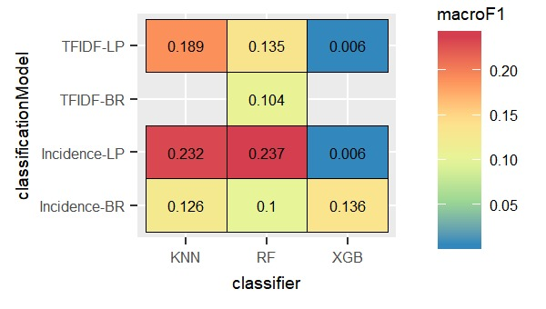

##Overview and motivation
A single text document often has multiple semantic aspects. A single news article related to politics may have aspects related to trade, technology and defense. Therefore, often a document needs to be tagged to multiple labels/categories, instead of a single category. Most of the classification algorithms deal with datasets which have a set of input features and only *one* output class. However, in reality the problem might be different from a typical binary or multiclass classification, as often a document or an image can be associated with multiple categories rather than a single category.

An introduction of enormous amount of documents belonging to multiple categories in the legal domain, makes it an attractive area for employing automated solutions. In this project we explore a public multi labelled legal text dataset that has been manually annotated over a decade. It contains laws related to the European Union, including treaties, legislation, case-law and legislative proposals, in 24 different languages. This is popularly known as the **EUR-Lex** dataset containing about twenty five thousand documents, around seven thousand labels and in several European languages. A skewed distribution of multiple labels per document, along with existence of the same data in multiple languages, makes this dataset an interesting proposition. Few publications have used an older version of the dataset which had around four thousand labels. The ones that have used this have reported relatively poor F1 values in the range of 40% (referred to as EUROVOC)[@LozaMencia2010] (which may be fair, given the high number of labels). There is no publications for the new dataset (having around 7000 labels), which motivates us to explore the problem of multilabel classification on this dataset. 


> **Multilable v/s Multiclass classification**  
In multi-label classification, each instance in the training set is associated with a set of labels, instead of a single label, and the task is to predict the *label-sets* of unseen instances, instead of a single label. There is a difference between *multi-class classification* and *multi-label classification*. In multi-class problem the classes or labels are mutually-exclusive, i.e. it makes the assumption that each instance can be assigned to only one label. E.g - an animal can be either a dog or a cat but not both. But in multi-label problem multiple labels may be assigned to an instance. E.g - a movie can belong to a comedy genre as well a detective genre.

##Project objectives

>>Can we use machine learning techniques to automatically annotate legal documents?

To answer the question we need to answer some research questions:  

* How well the classifiers perform over Eur-Lex dataset for two languages (English and Deutsch).  
* How the classifiers' performance changes with different features- one with term frequency–inverse document frequency(tf-idf), another with term incidence.
* Which flavour of multilabel transform algorithm perform best among all, the one which considers label correlation or the one which does not.
* How the classifiers' performance changes when the number of labels is reduced.

## Design overview (algorithms and methods we have used)
* Pre-processing:
     + Exclude stop words, perform lemmatization.
     + Extract features - term frequency–inverse document frequency(tf-idf) and term incidence.
     + Generate the MLD [@Gibaja:2015:TML:2737799.2716262] data format, which is needed for multi label data exploration and classification using _mldr_ [@charte2015working] and _utiml_ [@rivolliutiml] packages.
     
* Statistical exploration:
     + Basic exploration  - distribution  of attributes/labels
     + Multi-label specific exploration- labelset distribution, relationship among labels, and relationship between attributes and labels/labelsets

* Classification:  
     + Apply the classifiers (Nearest Neighbour, Random Forest, XGBoost) over the preprocessed dataset (tf-idf and term incidence) for German and English text, and for three flavours of multilabel classification methods:  
           - Binary Relevance (BR) [@godbole2004discriminative]
           - Label Powerset (LP) [@boutell2004learning]
           - Classifier Chain (CC) [@read2011classifier]
     
     + Apply the classifiers (Nearest Neighbour, Random Forest, XGBoost) over the preprocessed dataset (tf-idf and term incidence) for German and English text *for balanced labelsets*, and for two flavours of multilabel classification methods:  
           - Binary Relevance (BR)
           - Label Powerset (LP)

* The following evaluation measures have been used primarily to assess the multilabel predictive performance:
     + Accuracy
     + Hamming Loss
     + Micro F1
     + Macro F1
     
* Compare the performance of the state-of-the-art classifiers for:
    + Two languages (English and German)
    + Two kinds of features (tf-idf and incidence)
    + Three flavours of multilable classification algorithms (Binary Relevance, Label Powerset, Classifier Chain)
    + Balanced labelsets

## Data

### Name and source
European Union law documents (EUR-Lex).
The [data](https://ec.europa.eu/jrc/en/language-technologies/jrc-eurovoc-indexer#Download%20JEX) is located inside the software distributed by European Union.

### Data format
- The Eurlex dataset for every language comprises two files.  
- The documents(laws/treaties) and the document categories/labels is available in a cf file (acquis.cf).
- The content and the labels for each document has been stored in the file in the following way:  

    + Every **odd** line consists of *label-ids* and the *document-id* of a document. The labels and document-id is separted by a *#*.  
    + Every **even** line consists of the actual text.  

An example has been shown below in the diagram. On the 1st line there are two lable-ids - *3032, 525* and the document-id is *31958d1006(01)*, and the actual text is on 2nd line.

<center> ![[Fig1. Data format]](../docs/Figs/acquis.png) </center>

The mapping between label-id and label-name has been provided in a XML. A small snippet of the xml has been provided below.
```xml
<?xml version="1.0" encoding="UTF-8" ?>
<!DOCTYPE DESCRIPTEUR SYSTEM "descripteur.dtd">
<DESCRIPTEUR LNG="EN" VERSION="4_3">
  <RECORD>
    <DESCRIPTEUR_ID>4444</DESCRIPTEUR_ID>
    <LIBELLE>abandoned land</LIBELLE>
  </RECORD>
</DESCRIPTEUR>
```
The tag *DESCRIPTEUR_ID* contains the label-id and *LIBELLE* contains the label name.

## Preprocessing, exploratory analysis and classification of English legal corpus
### Text Preprocessing
For our task two kinds of  preprocessing is needed:

- **Text preprocessing**     
Text data contains many characters which do not convey much information, like punctuations, white spaces, stop words, etc. In English, certain words like “is”, “the” is present in every document and does not help to discriminate two documents. But again, depending on the language and the task at hand, we need to deal with such characters differently.
- **Preprocessing to generate the data expected by mldr**  
To study the MLD datasets traits (label distribution, relationship among labels and label imbalance) and perform classification over MLD datasets we need to transform the available dataset into [mldr](https://www.rdocumentation.org/packages/mldr/versions/0.4.0/topics/mldr) format - a sparse [ARFF](https://waikato.github.io/weka-wiki/arff_stable/) file containing features and labels , and a XML file containing the label information.

We first start with text preprocessing and some exploratory analysis over English text.
```{r init, message=FALSE, warning=FALSE, include=TRUE}
## Required packages
source("../scripts/requirements.R")

## Preprocessing Functions loaded
source("../scripts/preprocessing_utility.R")

## Dataset generation Functions loaded
source("../scripts/generate_dataset.R")

## Project specific settings
source("../configuration/config.R")

## Load classification utility methods
source("../scripts/classification_utility.R")

## English corpus specific variables
lang <- "english" # language chosen - english
fileName <- "../data/english/acquis.cf" # name of the file containing data (english)
tfidfFileName <- "../output/tfidf_EN" # name of tf-idf arff file (english)
incFileName <- "../output/inc_EN" # name of term incidence arff file (english)
labelFile <- "../data/english/desc_en.xml" # name of the label xml file (english)
```
The following code will load the text content and labels.
```{r load_text_en, include=TRUE, eval=TRUE }
if(!file.exists(fileName))
 stop(paste("file",fileName,"not found!"))
connection <- fileName  %>% file(open = "r")
raw_text_char <- connection %>% readLines(encoding = "UTF-8")
close.connection(connection)

raw_text_char[[1]] # 1st document's labels and doc-id
raw_text_char[[2]] # 1st document's text content
```
We have to preprocess the text to get the lemma without html tags, stopwords, punctuations and roman numerals. 
```{r preprocess_text, include=TRUE, eval=TRUE }
text_content_list <- generate_clean_text(raw_text_char)

text_content_list[[1]]
```
We need to preprocess labels also, as label names are in different file. The dataset- *acquis.cf* file just contains label-ids. Also the label names contains certain characters like space which is inconvenient to generate MLD datasets. The following code generates clean label name for all documents.
```{r get_clean_label_lst_en, include=TRUE, eval=TRUE }
class_labels_list <- generate_clean_labels(raw_text_char)

raw_text_char[[1]] # first row containing label-ids for 1st document

class_labels_list[[1]] # corresponding label-names for 1st document after preprocessing
```
After generating a cleaner version of text and labels we can take a deep dive into the first part of our data exploration.
We generate a dataframe such that each row contains one document's text and one label, for the data exploration.
```{r exploration_df_en, include=TRUE, eval=TRUE }
text <- character()
label <- character()
for (index in 1:length(text_content_list)) {
  temp_labelset <- unlist(class_labels_list[[index]]) # get list of labels for the document and unlist
  for (label_index in 1:length(temp_labelset)) # iterate for all labels of the document
  {
    text <- append(text, text_content_list[[index]]) #add to text list
    label <- append(label, temp_labelset[[label_index]]) #add to label list
  }
}

text_df <- as.data.frame(cbind(text, label), stringsAsFactors = FALSE) #generate data-frame from the text and label list

text_df[1:4,]
```

### Exploratory data analysis
We start exploration with wordcloud, which is a simple yet informative way to understand textual data and perform analysis.
To generate wordcloud first we have to generate tokens from the text, and count each token/word present in the corpus.
```{r wordcloud_all_en, include=TRUE, eval=TRUE }
#generate tokens and count of each word from corpus
tokens <- text_df %>%
unnest_tokens(word, text) %>%
dplyr::count(word, sort = TRUE) %>%
ungroup()

#generates word cloud
wordcloud(
words = tokens$word,
freq = tokens$n,
min.freq = 1,
max.words = 100,
rot.per = 0.35,
colors = brewer.pal(8, "Dark2"),
scale = c(5, 0.2)
)
```

The word cloud has been generated after adding some law and the dataset related stopwords like -*treaty, journal, europe*. We see that the word *state* among others, stands out and it seems the laws/treaties are related to a state more than a country. We also see words like *aid, product, import, export, trade, animal*, from which we can surmise a lot of legal laws are related to these topics. After getting some insight from the wordcloud we examine it further. It will be interesting to see which terms are common for different category of legal text. To get that, we need to count words for each category.
```{r tf_en, include=TRUE, eval=TRUE }
#generate tokens and count of each word (grouped by category/label)
tokens_by_label <- text_df %>%
  unnest_tokens(word, text) %>% #generate tokens
  dplyr::count(label, word, sort = TRUE) %>% #counts words for each category
  ungroup()
  
#generates total words in that category
  total_words <- tokens_by_label %>%
  group_by(label) %>%
  summarize(total = sum(n))
  
  tokens_by_label <- left_join(tokens_by_label, total_words)
  
  tokens_by_label 
```
There is one row in the data frame *tokens_by_label* for each word-label combination. *n* is the number of times that word is used in that legal text category/label and *total* is the total words in that category. Let us have a look at the distribution of (n/total) for each document category- the number of times a word appears in a label divided by the total number of terms in that category. Our dataset has around 7000 labels , and it will be difficult to analyse over all categories! Therefore, we will consider some of the labels for our analysis.
```{r tf_graph_en, include=TRUE, eval=TRUE , warning=FALSE}
#retrieve first 6 labels/categories
selected_labels <- unique(tokens_by_label$label)[1:8]

#generate distribution of (n/total) for 6 document categories
tokens_by_label %>% filter(
  label %in% selected_labels) %>%
  ggplot(aes(n / total, fill = label)) +
  geom_histogram(show.legend = FALSE, bins = 30) +
  xlim(NA, 0.0009) +
  facet_wrap( ~ label, ncol = 2, scales = "free_y")
```

The plots portray long tails on the right, and we can use the term frequency dataframe to plot term frequency and examine Zipf's law.

>> Zipf's law states that the frequency that a word appears is inversely proportional to its rank.

```{r zipf_en, include=TRUE, eval=TRUE }
#generate term frequency and rank of word in the document category
freq_by_rank <- tokens_by_label %>%
  group_by(label) %>%
  mutate(rank = row_number(),
  `term frequency` = n / total)

#plot term frequency and rank of word in the document category in log-log coordinates
freq_by_rank %>%
  ggplot(aes(rank, `term frequency`, color = label)) +
  geom_line(size = 1.1,
  alpha = 0.8,
  show.legend = FALSE) +
  scale_x_log10() +
  scale_y_log10()
```
The above plot is in log-log coordinates. We can see that text in all the categories in the corpus are almost similar to each other, and that the relationship between rank and frequency does have negative slope, implying that they follow Zipf's Law.
It would be interesting to find out top 10 words for each category, which will give us an idea what each category of law document deals with. To find the most importants words it would make sense to use tf-idf rather than term frequency, as tf-idf finds the important words for the content of each document category by decreasing the weight for commonly used words and increasing the weight for words that are not used very much in a collection or corpus of documents.  
```{r topk_mono_en, include=TRUE, eval=TRUE }
tokens_by_label <- bind_tf_idf(tokens_by_label, word, label, n) #generates tf-idf and binds to dataframe
tokens_by_label
```
```{r topk_plot, include=TRUE, eval=TRUE }

tokens_by_label %>%
  filter(
  label == "seed_" |
  label == "fodder_plant_" |
  label == "marketing_standard_" |
  label == "approximation_of_laws_"
  ) %>%
  arrange(desc(tf_idf)) %>%
  mutate(bigram = factor(word, levels = rev(unique(word)))) %>%
  group_by(label) %>%
  top_n(10) %>%  #top 10 words
  ungroup %>%
  ggplot(aes(word, tf_idf, fill = label)) +
  geom_col(show.legend = FALSE) +
  labs(x = NULL, y = NULL) +
  facet_wrap( ~ label, ncol = 2, scales = "free") +
  coord_flip()
```

We can see many common terms appearing for labels *fodder_plant_* and *marketing_standard_*. This implies many documents for marketing standard deals with fodder plant. *approximation_of_laws_*, *fodder_plant_* and *seed_* share an interesting term - "lufthansa".  
Sometimes bigrams are more meaningful than single words, and it would be interesting to see whether we make similar observation for bigrams.
We generate the tokens in similar way, except we use we used *token = "ngrams"* and *n=2* in the method *unnest_tokens.*
```{r topk_bi_plot_en, include=TRUE, eval=TRUE }
#generate bigram tokens
bigram_tokens <- text_df %>%
  filter(
  label == "seed_" |
  label == "fodder_plant_" |
  label == "marketing_standard_" |
  label == "approximation_of_laws_"
  ) %>%
  unnest_tokens(bigram, text, token = "ngrams", n = 2) %>%
  dplyr::count(label, bigram, sort = TRUE) %>%
  ungroup()
  
#generate count of words in the category
total_words <- bigram_tokens %>%
  group_by(label) %>%
  summarize(total = sum(n))
  
bigram_tokens <- left_join(bigram_tokens, total_words)
bigram_tokens <- bind_tf_idf(bigram_tokens, bigram, label, n)
  
bigram_tokens %>%
  arrange(desc(tf_idf)) %>%
  mutate(bigram = factor(bigram, levels = rev(unique(bigram)))) %>%
  group_by(label) %>%
  top_n(10) %>%
  ungroup %>%
  ggplot(aes(bigram, tf_idf, fill = label)) +
  geom_col(show.legend = FALSE) +
  labs(x = NULL, y = NULL) +
  facet_wrap( ~ label, ncol = 2, scales = "free") +
  coord_flip()
```

Here we do not see much common bigrams for the categories. The bigrams generated are very specific to those categories.
Another way to view word connections is to treat them as a network, similar to a social network. Word networks show term association and cohesion. In a network graph, the circles are called nodes and represent individual terms, while the lines connecting the circles are called edges and represent the connections between the terms. We can see some interesting word association in the Fig below.
```{r wordass_en, include=TRUE, eval=TRUE }
(
  bigram_graph <-
  bigram_tokens %>% dplyr::count(bigram, sort = TRUE) %>% #count bigram occurence
  top_n(50) %>% #select top 50 frequent bigrams
  graph_from_data_frame() #generate graph from dataframe
  )
  
#generate word network graph
  ggraph(bigram_graph, layout = "fr") +
  geom_edge_link() + #draws edges between nodes
  geom_node_point(color = "lightblue", size = 5) + #assign colour and size to nodes of graph
  geom_node_text(aes(label = name), vjust = 1, hjust = 1, check_overlap = TRUE) + #adjusts text in graph
  theme_void() 
```
From the above exploratory analysis we can surmise that tf-idf and term incidence can act as discriminatory features, as we could see related categories to share terms/bigrams. We will further verify this from the instance-label concurrence graph, after generating the dataset in a format expected by the _mldr_ package.

### Preprocessing for mldr
To perform the exploratory analysis over the MLD dataset traits (label distribution, relationship among labels and label imbalance) we need to generate the dataset in the format which can read by _mldr_ package. The method *generate_dataset* generates the dataset (ARFF and XML) in mldr compliant format. Since our objective in performing exploratory analysis over the multilabel dataset is to inspect certain multi-label dataset traits, it is fine if we perform the analysis over one of the datasets (tf-idf or incidence). We will generate the tf-idf dataset.
```{r gen_dataset_en, include=TRUE, eval=TRUE}
## arguments
# is_batch -> should be true only for classification purpose
# text_list -> list of text content
# label_list-> list of labelset
# tfidf_dataset -> flag whether to generate tfidf dataset
# incidence_dataset ->  flag whether to generate incidence dataset
generate_dataset(FALSE,text_content_list,class_labels_list,TRUE,FALSE)
```
### Exploratory analysis over multilabel dataset
After mldr compliant datasets are generated, they are loaded. We are considering tf-idf dataset for our analysis.
```{r load_mldr_en, include=TRUE, cached=TRUE}
if(!file.exists(paste(tfidfFileName, 1, ".arff", sep = "")) ||
   !file.exists(paste(tfidfFileName, 1, ".xml", sep = "")))
   stop(paste("mldr files (arff/XML) ", tfidfFileName, 1, " not found!", sep =
   ""))
   
#loads english tfidf mldr dataset
   eurlex <- mldr(paste(tfidfFileName, "1", sep = ""))
   summary(eurlex)
```
As we know the value of scumble lies in the range [0,1], and a low score would denote a MLD with not much concurrence among imbalanced labels and the resampling algorithms would work better. The scumble value of our dataset is pretty high, implying there is a good amount of concurrence among imbalanced labels. The level of imbalance of a determinate label can also be measured by the imbalance ratio per label (IRLbl). This value will be 1 for the most frequent label and a greater value for the rest. The larger the IRLbl is, the higher would be the imbalance level for the considered label. The mean IRbl (meanIR) gives the mean IRLbl value over all labels. For the dataset the meanIR is also quite high indicating a good amount of imbalance. Therefore from the above statistics we can infer it is indeed a difficult classification problem. 

#### Labels' information
Labels' information in the MLD, including the number of times they appear, their IRLbl and SCUMBLE measures, can be retrieved by using the *labels* member of the *mldr* class.
```{r mldr_label_en, include=TRUE, cached=TRUE}
#inspect first 20 labels
head(eurlex$labels, 20)
```
#### Concurrence Plot (LC)
The concurrence plot explores interactions among labels. We choose some labels for the plot, as plotting all of them would produce a very confusing result.
We can choose the labels from the mldr attribute *eurlex\$labels*. But, the plots of mldr use *eurlex\$attributes*, and they contain all features and labels. So we need to find those labels' indices in *eurlex\$attributes*. *eurlex\$attributes* start with features and ends with labels.
```{r mldr_attrib_en, include=TRUE, cached=TRUE }
#inspect first 6 attributes
head(eurlex$attributes)
#inspect last 6 attributes, which are labels (ending with hyphen)
tail(eurlex$attributes)

#getting indices of some labels/categories in eurlex$attributes, having words - seed/fodder/marketing/approximation_of_laws_
plot_labels <-  grep('seed|fodder|marketing|approximation_of_laws_',rownames(eurlex[["labels"]])) + (eurlex$measures$num.attributes - eurlex$measures$num.labels)

names(eurlex$attributes)[plot_labels]
```
The concurrence plot explores interactions among labels. This plot has a circular shape, with the circumference partitioned into many disjoint arcs representing labels. Each arc has length proportional to the number of instances where the label is present. These arcs are in turn divided into bands that join two of them, showing the relation between the corresponding labels. The width of each band is proportional to the number of instances in which both labels appear simultaneously. Since drawing interactions among all the labels can produce a confusing result, we have plotted for some labels.
We can plot the concurrence plot using the plot() using type "LC"
```{r plot_lc_en, include=TRUE, eval=TRUE  }
par(mai=c(0,0,0,0)) #setting margins 0 to get a clear plot
plot(eurlex, type="LC", labelIndices=plot_labels, title=" ")
```

We can see a thick purple band joining *seed_* and *mar-ard_ (marketing_standard_)*, which means there are instances common to labels *seed_* and *marketing_standard_*. There are no bands connecting *approximation_of_laws**(app-aws_)* and *seed_*, which means there are no common instances between them, and which also agrees with the top-k words plot, where we saw no common terms for these categories. This further supports our assumption that tf-idf and term-incidence might be good discrimatory features for our classification problem.

#### Label histogram Plot (LH)
The label histogram relates labels and instances in a way that shows how well-represented labels are in general. The X axis is assigned to the number of instances and the Y axis to the amount of labels. In our plot the data is concentrated on the left side of the plot, which means that a great number of labels are appearing in very few instances.
```{r plot_lh_en, include=TRUE, eval=TRUE  }
plot(eurlex, type='LH',col = brewer.pal(11, 'Spectral'), title='Eurlex', xlim=c(0,20))
```
We can see most of the instances have very less labels considering the total number of labels is around 7000.
#### Labelset histogram (LSH)
The labelset histogram is similar to LH plot but, instead of representing the number of instances in which each label appears, it shows the amount of labelsets. Here also we observe very less instances have large number of labelsets, considering huge number of labels (around 7000).
```{r plot_lsh_en, include=TRUE, eval=TRUE  }
plot(eurlex, type='LSH',col = brewer.pal(11, 'Spectral'), title='Eurlex', ylim=c(0,100), xlim=c(0,20))
```
#### Cardinality histogram (CH)
The cardinality histogram represents the amount of labels instances have in general. Since data has accumulated on the left side of the plot it means that very less instances have a notable amount of labels.
```{r plot_ch_en, include=TRUE, eval=TRUE  }
plot(eurlex, type='CH',col = brewer.pal(11, 'Spectral'), title='Eurlex', xlim=c(0,20))
```

### Multilabel Classification

#### Choice of classification algorithms
Multilabel classification is different from binary/multiclass classification as there are multiple labels associated with an instance. Therefore we cannot use the existing algorithms as is. We either need to change the existing algorithms - *Algorithm adaptation*, or we need to transform the data to make it suitable to use with existing alogorithms - *Problem transformation*
There are many possibilities to deal with multi-label classification using *Problem transformation*.

 >>Problem transformation: Transforming the original data to make it suitable to existing traditional classification algorithms and combining the obtained predictions to build the labelsets given as output result.
 
There are several transformation methods in literature. Three have been defined and used for our case study.  

  - **Binary Relevance (BR)**: It is an adaptation of OVA (one-vs-all) to the multilabel scenario and transforms the original multilabel dataset into several binary datasets. Each classifier predicts either the membership or the non-membership of one class. A union of all predicted classes is taken as the multi-label output. The approach is faster and easy to implement, but *ignores the possible correlations between class labels*.  
 - **Label Powerset (LP)**: This method transforms the multilabel dataset into a multiclass dataset by using the labelset of each instance as class identifier. This approach takes possible correlations between class labels into account unlike the BR. The downside of the method is it has a high computational complexity and when the number of classes increases the number of distinct label combinations can grow exponentially.
 -  **Classifier Chains (CC)**: This method comprises a chain of binary classifiers \(C_0, C_1, . . . , C_m \) is constructed, where a classifier \(C_i\) uses the predictions of all the classifier \(C_j\) , where j < i. The method can takes into account label correlations. The total number of classifiers needed for this approach is equal to the number of classes, but the training of the classifiers is more involved. 

We have used BR, LP and CC for our problem, and we will try to answer the research question: *Which flavour of multilabel classification method performs the best*. We have chosen these three flavours as we wanted to investigate which flavour of transforms works better for this dataset- the one which considers label correlation or the one which treats the labels independently.  

#### Choice of evaluation metric

In multi-label classification we cannot define misclassification as a hard correct or incorrect, but a prediction comprising subset of actual classes is deemed better than containg none of them. Multilabel evaluation metrics are grouped into two main categories: example based and label based metrics.  

- **Example based metrics** are computed individually for each instance, then averaged to obtain the final
value. E.g - Hamming Loss  
- **Label based metrics** are computed per label, instead of per instance. There are two approaches called micro-averaging and macro-averaging.  

>>A Macro-average will compute the metric independently for each class and then take the average (hence treating all classes equally). E.g - Macro Precision, Macro Recall, Macro F1.  

>> A Micro-average will aggregate the contributions of all classes to compute the average metric.  E.g - Micro Precision, Micro Recall, Micro F1.

Since both the datasets (English and German) have huge number of labels and has severe amount of class-imbalance, **Macro-F1** would be a more appropriate choice as mentioned in literature [@narasimhan2016optimizing]. **Macro** is preferred in our case over micro as the former gives equal importance to each class whereas the latter gives equal importance to each sample (which means with increasing number of samples, it will favour the majority classes).

To perform classification we generate multiple batches of datasets (arff and xml), as mldr is very slow in loading large arff files and performing classification.
```{r classification_init, message=TRUE, include=TRUE,eval=TRUE  }
generate_dataset(TRUE, text_content_list, class_labels_list, TRUE, TRUE)
set.seed(123) #ensures to reproduce results.
```


#### Classification on tf-idf dataset using BR
The method *classify* performs classification over the specified dataset, for one of the multilabel flavour (Binary relevance -*br*, Labelpowerset- *lp* or Classifier Chain-*cc*), and for one of the classifiers (Nearest Neighbour-*KNN*, Random Forest-*RF*, XGBoost-*XGB*). The last input to method *classify* is a flag which determines whether to consider balanced labelsets or not. The method returns the average of the metrics' values over the batches of dataset.

We start with classification using BR Transform over tf-idf English dataset, using original labels (non-reduced).
```{r br_tf_en, message = TRUE, include = TRUE, eval = TRUE, warning= FALSE}
knn_tfidf_br_results_mean <- classify(tfidfFileName, "br", "KNN", FALSE)
rf_tfidf_br_results_mean <- classify(tfidfFileName, "br", "RF", FALSE)
xgb_tfidf_br_results_mean <- classify(tfidfFileName, "br", "XGB", FALSE)
```

```{r br_tfidf_plot_en, message=TRUE, include=TRUE,eval=TRUE  }
classifiers <- c("KNN",'random forest','xgboost')
performance_br <- as.data.frame(rbind( knn_tfidf_br_results_mean, rf_tfidf_br_results_mean, xgb_tfidf_br_results_mean))
performance_br[["model"]] <- classifiers

#generate dataframe having columns -> metric_name, metric_value, model_name
perf_metric_br <- gather(performance_br,metrics,value,-model)

ggplot(perf_metric_br)+
  geom_point(aes(x=model,y=value,color=model),size=5,alpha=0.7)+ #create scatterplot
  facet_grid(metrics~.,scales='free_x', space='free_x')+ #Lay out panels in a grid
  coord_flip()+ #Flip cartesian coordinates
  theme_bw()+theme(strip.text.y = element_text(angle=0)) #makes text on y axis parallel to x axis
```

We compared the three models where the labels are assumed to be independent. The three models performed almost similarly. In certain aspects like micro-precision and precision Random forest performed much better than the others.

#### Classification on tf-idf dataset using LP
We similarly perform classification using LP flavour of MLD classification and plot the metrics.
```{r lp_tf_en, message=TRUE, include=TRUE,eval=TRUE, warning= FALSE  }
knn_tfidf_lp_results_mean <- classify(tfidfFileName,"lp","KNN", FALSE)
rf_tfidf_lp_results_mean <- classify(tfidfFileName,"lp","RF", FALSE)
xgb_tfidf_lp_results_mean <- classify(tfidfFileName,"lp","XGB", FALSE)
```
```{r lp_tfidf_plot_en, message=TRUE, include=TRUE, eval=TRUE  }
performance_lp <- as.data.frame(rbind( knn_tfidf_lp_results_mean, rf_tfidf_lp_results_mean, xgb_tfidf_lp_results_mean))
performance_lp[["model"]] <- classifiers
perf_metric_lp <- gather(performance_lp,metrics,value,-model)

ggplot(perf_metric_lp)+geom_point(aes(x=model,y=value,color=model),size=5,alpha=0.7)+facet_grid(metrics~.,scales='free_x', space='free_x')+coord_flip()+theme_bw()+theme(strip.text.y = element_text(angle=0))
```
Here we observe Random Forest achieved the highest accuracy compared to the XGBoost model which significantly achieved the lowest accuracy.

#### Classification on tf-idf dataset using CC
Similarly we perform classification and plot the metrics
```{r cc_tfidf_en, message=TRUE, include=TRUE, eval=TRUE, warning= FALSE  }
knn_tfidf_cc_results_mean <- classify(tfidfFileName,"cc","KNN", FALSE)
rf_tfidf_cc_results_mean <- classify(tfidfFileName,"cc","RF", FALSE)
xgb_tfidf_cc_results_mean <- classify(tfidfFileName,"cc","XGB", FALSE)
```
```{r cc_tfidf_plot_en, message=TRUE, include=TRUE,eval=TRUE  }
performance_cc <- as.data.frame(rbind( knn_tfidf_cc_results_mean, rf_tfidf_cc_results_mean, xgb_tfidf_cc_results_mean))
performance_cc[["model"]] <- classifiers
perf_metric_cc <- gather(performance_cc,metrics,value,-model)

ggplot(perf_metric_cc)+geom_point(aes(x=model,y=value,color=model),size=5,alpha=0.7)+facet_grid(metrics~.,scales='free_x', space='free_x')+coord_flip()+theme_bw()+theme(strip.text.y = element_text(angle=0))
```
Here we observe XGBoost and Random Forest produced comparable performance. Though Random Forest achieved much better score for micro-precision (0.725), compared to XGBoost(0.598) and KNN(0.469).

#### Comparison among MLD algorithms on tf-idf dataset
Here we will try to answer the research question - *Which classifier performs best among LP, BR, CC for the dataset tf-idf (English)*.
```{r mld_tfidf_plot_en, message=TRUE, include=TRUE,eval=TRUE  }
g_br <- ggplot(perf_metric_br)+
  geom_tile(aes(x=model,y=metrics,fill=value),color="black")+ #creates tiles
  geom_text(aes(x=model,y=metrics,label=round(value,3)),color="black")+ #adds formatting to text
  scale_fill_distiller(palette = "Spectral")+ # smoothly interpolates 6 colours from spectral palette to a continuous scale
  ggtitle("BR Transform")

g_lp <- ggplot(perf_metric_lp)+geom_tile(aes(x=model,y=metrics,fill=value),color="black")+geom_text(aes(x=model,y=metrics,label=round(value,3)),color="black")+scale_fill_distiller(palette = "Spectral")+ggtitle("LP Transform")

g_cc <- ggplot(perf_metric_cc)+geom_tile(aes(x=model,y=metrics,fill=value),color="black")+geom_text(aes(x=model,y=metrics,label=round(value,3)),color="black")+scale_fill_distiller(palette = "Spectral")+ggtitle("CC Transform")

grid.arrange(g_br, g_lp, g_cc, nrow = 2,ncol = 2)
```
Overall Random Forest performs better with respect to most of the metrics and for all the 3 types of transform algorithms. With respect to the metric macro-F1 we observe LP-Random Forest combination performs the best. This implies the transform catering to the label correlation performs the best, on the tf-idf English dataset.

#### Classification on incidence dataset
We similarly perform classification over the incidence dataset using BR, LP and CC.
```{r inc_all_en , message=TRUE, include=TRUE,eval=TRUE, warning=FALSE }
knn_inc_br_results_mean <- classify(incFileName,"br","KNN", FALSE)
rf_inc_br_results_mean <- classify(incFileName,"br","RF", FALSE)
xgb_inc_br_results_mean <- classify(incFileName,"br","XGB", FALSE)

knn_inc_lp_results_mean <- classify(incFileName,"lp","KNN", FALSE)
rf_inc_lp_results_mean <- classify(incFileName,"lp","RF", FALSE)
xgb_inc_lp_results_mean <- classify(incFileName,"lp","XGB", FALSE)

knn_inc_cc_results_mean <- classify(incFileName,"cc","KNN", FALSE)
rf_inc_cc_results_mean <- classify(incFileName,"cc","RF", FALSE)
xgb_inc_cc_results_mean <- classify(incFileName,"cc","XGB", FALSE)
```

After classification we plot the results similarly as we did for tf-idf dataset.
```{r br_inc_plot_en, message=TRUE, include=TRUE,eval=TRUE  }
performance_lp <- as.data.frame(rbind( knn_inc_br_results_mean, rf_inc_br_results_mean, xgb_inc_br_results_mean))
performance_lp[["model"]] <- classifiers

perf_metric_lp <- gather(performance_lp,metrics,value,-model)

ggplot(perf_metric_lp)+geom_point(aes(x=model,y=value,color=model),size=5,alpha=0.7)+facet_grid(metrics~.,scales='free_x', space='free_x')+coord_flip()+theme_bw()+theme(strip.text.y = element_text(angle=0))
```

Here we observe all the classifiers performed very closely to each other, and it is difficult to point out which is the best among all. Though with respect to the metric macro-F1 Random forest performs the best.
```{r br_lp_inc_plot_en, message=TRUE, include=TRUE,eval=TRUE  }
performance_lp <- as.data.frame(rbind( knn_inc_lp_results_mean, rf_inc_lp_results_mean, xgb_inc_lp_results_mean))
performance_lp[["model"]] <- classifiers
perf_metric_lp <- gather(performance_lp,metrics,value,-model)

ggplot(perf_metric_lp)+geom_point(aes(x=model,y=value,color=model),size=5,alpha=0.7)+facet_grid(metrics~.,scales='free_x', space='free_x')+coord_flip()+theme_bw()+theme(strip.text.y = element_text(angle=0))
```

Here we observe the Random forest to be the clear winner, and XGBoost performs the worst.
```{r cc_inc_plot_en, message=TRUE, include=TRUE,eval=TRUE  }
performance_cc <- as.data.frame(rbind( knn_inc_cc_results_mean, rf_inc_cc_results_mean, xgb_inc_cc_results_mean))
performance_cc[["model"]] <- classifiers
perf_metric_cc <- gather(performance_cc,metrics,value,-model)

ggplot(perf_metric_cc)+geom_point(aes(x=model,y=value,color=model),size=5,alpha=0.7)+facet_grid(metrics~.,scales='free_x', space='free_x')+coord_flip()+theme_bw()+theme(strip.text.y = element_text(angle=0))
```

Here, all the classifiers performed very close to each other, no one is the clear winner. Random Forest however performs much better with respect to metrics micro precision.

#### Comparison of MLD classification algorithms on incidence dataset
After performing classification over the incidence dataset, we try to answer the research question- *Which MLD classifier flavour performs best for English incidence dataset ?*

```{r mld_inc_plot_en, message=TRUE, include=TRUE,eval=TRUE  }
g_br <- ggplot(perf_metric_br)+geom_tile(aes(x=model,y=metrics,fill=value),color="black")+geom_text(aes(x=model,y=metrics,label=round(value,3)),color="black")+scale_fill_distiller(palette = "Spectral")+ggtitle("BR Transform")

g_lp <- ggplot(perf_metric_lp)+geom_tile(aes(x=model,y=metrics,fill=value),color="black")+geom_text(aes(x=model,y=metrics,label=round(value,3)),color="black")+scale_fill_distiller(palette = "Spectral")+ggtitle("LP Transform")

g_cc <- ggplot(perf_metric_cc)+geom_tile(aes(x=model,y=metrics,fill=value),color="black")+geom_text(aes(x=model,y=metrics,label=round(value,3)),color="black")+scale_fill_distiller(palette = "Spectral")+ggtitle("CC Transform")

grid.arrange(g_br, g_lp, g_cc, nrow = 2,ncol = 2)
```
Here also LP along with Random Forest performs best with respect to macro-F1. Infact LP+Random Forest performs better than others with respect to most of the other metrics.

#### Comparison among incidence and tf-idf datasets
Now we will try to answer the research question- *which features proved to be better- tf-idf or term incidence to English corpus?* We have considered only macro-F1 in the plot.

```{r mld_inc_tfidf_plot, message=TRUE, include=TRUE,eval=TRUE  }
classifiers <- c("KNN","RF","XGB")
performance_lp_tfidf <- as.data.frame(cbind( knn_tfidf_lp_results_mean[["F1"]], rf_tfidf_lp_results_mean[["F1"]], rf_tfidf_lp_results_mean[["F1"]]))
names(performance_lp_tfidf) <- classifiers
performance_lp_tfidf[["classificationModel"]] <- c('TFIDF-LP')

performance_cc_tfidf <- as.data.frame(cbind( knn_tfidf_cc_results_mean[["F1"]], rf_tfidf_cc_results_mean[["F1"]], rf_tfidf_cc_results_mean[["F1"]]))
names(performance_cc_tfidf) <- classifiers
performance_cc_tfidf[["classificationModel"]] <- c('TFIDF-CC')

performance_br_tfidf <- as.data.frame(cbind( knn_tfidf_br_results_mean[["F1"]], rf_tfidf_br_results_mean[["F1"]], rf_tfidf_br_results_mean[["F1"]]))
names(performance_br_tfidf) <- classifiers
performance_br_tfidf[["classificationModel"]] <- c('TFIDF-BR')

performance_lp_inc <- as.data.frame(cbind( knn_inc_lp_results_mean[["F1"]], rf_inc_lp_results_mean[["F1"]], rf_tfidf_lp_results_mean[["F1"]]))
names(performance_lp_inc) <- classifiers
performance_lp_inc[["classificationModel"]] <- c('Incidence-LP')

performance_cc_inc <- as.data.frame(cbind( knn_inc_cc_results_mean[["F1"]], rf_inc_cc_results_mean[["F1"]], rf_inc_cc_results_mean[["F1"]]))
names(performance_cc_inc) <- classifiers
performance_cc_inc[["classificationModel"]] <- c('Incidence-CC')

performance_br_inc <- as.data.frame(cbind( knn_inc_br_results_mean[["F1"]], rf_inc_br_results_mean[["F1"]], rf_inc_br_results_mean[["F1"]]))
names(performance_br_inc) <- classifiers
performance_br_inc[["classificationModel"]] <- c('Incidence-BR')


performance_all <- as.data.frame(rbind( performance_lp_tfidf, performance_cc_tfidf,performance_br_tfidf,performance_lp_inc,performance_cc_inc,performance_br_inc))
perf_metric <- gather(performance_all,classifier,macroF1,-classificationModel)

ggplot(perf_metric)+geom_tile(aes(x=classificationModel,y=classifier,fill=macroF1),color="black")+geom_text(aes(x=classificationModel,y=classifier,label=round(macroF1,3)),color="black")+scale_fill_distiller(palette = "Spectral")
```
For the English dataset, we observed higher macro F1 rates over all the nine trained classifiers when we used TF-IDFs as the instances features. TF-IDFs are more powerful representative features than simply using the incidence of terms as features. The experiments show that Label Powerset combined with Random forest recorded the best result for the two type of features(TF-IDF and Incidence), whereas the Label Powerset method combined with XGB preformed the worst.


#### Classification using balanced labelsets
Classification on the tf-idf dataset is done similarly by using BR, LP and CC, but using balanced labelsets. By reducing labels we mean disabling majority labels on instances with highly imbalanced labels. We will try to answer the research question- *whether classification accuracy improves with balanced labelsets?*. To answer this first we have to answer another research question- *which flavour of MLD classification algorithm and classifier(knn,rf,xgb) performs best for balanced labelsets?*  
We are considering only tf-idf dataset as performance of the classification was comparable on both the datasets.
```{r cls_red_labels_en , message=TRUE, include=TRUE, eval=TRUE, warning= FALSE  }
knn_tfidf_br_red_results_mean <- classify(tfidfFileName,"br","KNN", TRUE)
rf_tfidf_br_red_results_mean <- classify(tfidfFileName,"br","RF", TRUE)
xgb_tfidf_br_red_results_mean <- classify(tfidfFileName,"br","XGB", TRUE)

knn_tfidf_lp_red_results_mean <- classify(tfidfFileName,"lp","KNN", TRUE)
rf_tfidf_lp_red_results_mean <- classify(tfidfFileName,"lp","RF", TRUE)
xgb_tfidf_lp_red_results_mean <- classify(tfidfFileName,"lp","XGB", TRUE)

knn_tfidf_cc_red_results_mean <- classify(tfidfFileName,"cc","KNN", TRUE)
rf_tfidf_cc_red_results_mean <- classify(tfidfFileName,"cc","RF", TRUE)
xgb_tfidf_cc_red_results_mean <- classify(tfidfFileName,"cc","XGB", TRUE)
```

```{r tfidf_red_label_plot_en, message=TRUE, include=TRUE,eval=TRUE  }
performance_br <- as.data.frame(rbind( knn_tfidf_br_red_results_mean, rf_tfidf_br_red_results_mean,xgb_tfidf_br_red_results_mean))
performance_br[["model"]] <- classifiers

performance_lp <- as.data.frame(rbind( knn_tfidf_lp_red_results_mean, rf_tfidf_lp_red_results_mean,xgb_tfidf_lp_red_results_mean))
performance_lp[["model"]] <- classifiers

performance_cc <- as.data.frame(rbind( knn_tfidf_cc_red_results_mean, rf_tfidf_cc_red_results_mean,xgb_tfidf_cc_red_results_mean))
performance_cc[["model"]] <- classifiers

perf_metric_br <- gather(performance_br,metrics,value,-model)
perf_metric_lp <- gather(performance_lp,metrics,value,-model)
perf_metric_cc <- gather(performance_cc,metrics,value,-model)

g_br <- ggplot(perf_metric_br)+geom_tile(aes(x=model,y=metrics,fill=value),color="white")+geom_text(aes(x=model,y=metrics,label=round(value,3)),color="black")+scale_fill_distiller(palette = "Spectral")+ggtitle("BR Transform")

g_lp <- ggplot(perf_metric_lp)+geom_tile(aes(x=model,y=metrics,fill=value),color="white")+geom_text(aes(x=model,y=metrics,label=round(value,3)),color="black")+scale_fill_distiller(palette = "Spectral")+ggtitle("LP Transform")

g_cc <- ggplot(perf_metric_cc)+geom_tile(aes(x=model,y=metrics,fill=value),color="white")+geom_text(aes(x=model,y=metrics,label=round(value,3)),color="black")+scale_fill_distiller(palette = "Spectral")+ggtitle("CC Transform")

grid.arrange(g_br, g_lp, g_cc, nrow = 2,ncol = 2)
```

With respect to Macro-F1, LP and Random Forest performs the best with the score of 0.258. For the original datasets (without balanced labelsets), the macro-F1 score was 0.25. Therefore, there was a very slight improvement with the label reduction.

We can conclude for the English balanced labelsets, that we observed better performance for the incidence features for all the classifiers compared to the performance with the complete label sets. LP combined with the Random Forest classifier outperformed the performance for the same classification model trained on the complete set with the tf-idf features. It can be said that for more balanced label sets, the terms incidencs features were sufficient even for the English dataset.

## Preprocessing, exploratory analysis and classification of German legal corpus
Now we will perform preprocessing, a brief data exploratory analysis and classification on the **German** corpus and answer rest of the research questions.
We load German specific configurations.
```{r init_de, message=FALSE, warning=FALSE, include=TRUE}
## remove some memory consuming variables used in english corpus analysis
rm(list = c('bigram_graph','bigram_tokens','class_labels_list','dtm_incidence','dtm_labels','dtm_tfidf','eurlex','raw_text_char','text_content_list','text_df','xml_root', 'label_corpus','text_corpus','tokens','tokens_by_label','total_words','freq_by_rank'))

## load german specific variables
lang <- "german"
fileName <- "../data/german/acquis_german.cf"
tfidfFileName <- "../output/tfidf_DE"
incFileName <- "../output/inc_DE"
labelFile <- "../data/german/desc_de.xml"
model_file <- "../output/german-gsd-ud-2.3-181115.udpipe"
```
### Preprocessing
Preprocessing for German text is similar to English text except the list of stopwords and the method of lemmatization. For German text we have used _udpipe_ model as _lemmatize_strings_ from package *textstem* does not support lemmatization for German language.
The following code will load and preprocess the text.
```{r load_text_de, include=TRUE, eval=TRUE }
if(!file.exists(fileName))
 stop(paste("file",fileName,"not found!"))

connection <- fileName  %>% file(open = "r")
raw_text_char <- connection %>% readLines(encoding = "UTF-8")
close.connection(connection)

raw_text_char[[1]] # 1st document's labels and doc-id
raw_text_char[[2]] # 1st document's text content

text_content_list <- generate_clean_text(raw_text_char)

text_content_list[[1]]
```
We need to preprocess labels, as label names are in different file, similar as in English corpus.
```{r get_clean_label_lst_de, include=TRUE, eval=TRUE }
class_labels_list <- generate_clean_labels(raw_text_char)

raw_text_char[[1]] # first row containing label-ids for 1st document

class_labels_list[[1]] # corresponding label-names for 1st document after preprocessing
```
After generating a cleaner version of text and labels we can take a deep dive into the first part of our data exploration.
We generate a dataframe such that each row contains one document's text and one label.
```{r exploration_df_de, include=TRUE, eval=TRUE,warning=FALSE,message=FALSE }
text <- character()
label <- character()
for (index in 1:length(text_content_list)) {
  temp_labelset <- unlist(class_labels_list[[index]])
  for (label_index in 1:length(temp_labelset))
  {
    text <- append(text, text_content_list[[index]])
  label <- append(label, temp_labelset[[label_index]])
  }
}

text_df <- as.data.frame(cbind(text, label), stringsAsFactors = FALSE)

text_df[1:4,]
```
### Exploratory data analysis
We start exploration with wordcloud as we did for english text, and investigate whether we see similar terms as in English.
```{r wordcloud_all_de, include=TRUE, eval=TRUE }
#generate tokens and count of each word from text 
tokens <- text_df %>%
  unnest_tokens(word, text) %>%
  dplyr::count( word, sort = TRUE) %>%
  ungroup()

#generating wordcloud
wordcloud(words = tokens$word, freq = tokens$n, min.freq = 1, max.words=100, rot.per=0.35,colors=brewer.pal(8, "Dark2"), scale = c(3, 0.2))
```
The translated version of English stopwords has been added to German stopword list along with German stopwords provided by _stopwords()_, but we get different prominent words. The words- *mussen, verordnung, europaisch* stands out among others. Similar to english text analysis it will be interesting to see which terms are common for different category of the german legal text. To get that, we need to count words for each category.
```{r tf_de, include=TRUE, eval=TRUE }
tokens_by_label <- text_df %>%
  unnest_tokens(word, text) %>% #generate tokens
  dplyr::count(label, word, sort = TRUE) %>% #counts words for each category
  ungroup()
  
total_words <- tokens_by_label %>%
  group_by(label) %>%
  summarize(total = sum(n))
  
tokens_by_label <- left_join(tokens_by_label, total_words)
  
tokens_by_label 
```
Let us have a look at the distribution of (n/total) for some of the document categories.
```{r tf_graph_de, include=TRUE, eval=TRUE , warning=FALSE}
selected_labels <- unique(tokens_by_label$label)[1:8]

tokens_by_label %>% filter(label %in% selected_labels) %>%
ggplot(aes(n / total, fill = label)) +
geom_histogram(show.legend = FALSE, bins=30) +
xlim(NA, 0.0009) +
facet_wrap(~ label, ncol = 2, scales = "free_y")
```
For German text also the plots portray long tails on the right, and we can similarly use the term frequency dataframe to plot term frequency and examine Zipf's law.
```{r zipf_de, include=TRUE, eval=TRUE }
freq_by_rank <- tokens_by_label %>%
  group_by(label) %>%
  mutate(rank = row_number(),
  `term frequency` = n / total)

freq_by_rank %>%
  ggplot(aes(rank, `term frequency`, color = label)) +
  geom_line(size = 1.1,
  alpha = 0.8,
  show.legend = FALSE) +
  scale_x_log10() +
  scale_y_log10()
```
The above plot is in log-log coordinates. We can see that text in all the categories in the German corpus are almost similar to each other, and that the relationship between rank and frequency does have negative slope, implying that they follow Zipf's Law.
Similar to the English text analysis we would find out top 10 words for each category, which will give us an idea what each category of law document deals with. We use tf-idf as before to find the important words for the content of each document category.  
```{r topk_mono_de, include=TRUE, eval=TRUE }

tokens_by_label <- bind_tf_idf(tokens_by_label, word, label, n) #enerates tf-idf and binds to dataframe
tokens_by_label
```
```{r topk_plot_de, include=TRUE, eval=TRUE }

tokens_by_label %>%
  filter(
  label == "industrieinvestition_" |
  label == "industriestatistik_" |
  label == "wirtschaftsstatistische_erhebung_" |
  label == "frischfleisch_"
  ) %>%
  arrange(desc(tf_idf)) %>%
  mutate(bigram = factor(word, levels = rev(unique(word)))) %>%
  group_by(label) %>%
  top_n(10) %>%
  ungroup %>%
  ggplot(aes(word, tf_idf, fill = label)) +
  geom_col(show.legend = FALSE) +
  labs(x = NULL, y = NULL) +
  facet_wrap( ~ label, ncol = 2, scales = "free") +
  coord_flip()
```
We can see common terms appearing for labels *industrieinvestition_* ,*industriestatistik_* and *wirtschaftsstatistische_erhebung_*. These documents share terms like - *reparatur, maschin, herstellung, fleisch*, which implies many industry investment oriented documents are focussed on machine, manufacturing and meat. We observe that *frischfleisch_* does not share any term other than *fleisch*.
We try to see if these categories share bigrams as well.
```{r topk_bi_de_plot, include=TRUE, eval=TRUE }
bigram_tokens <- text_df %>%
  unnest_tokens(bigram, text, token = "ngrams", n = 2) %>%
  dplyr::count(label, bigram, sort = TRUE) %>%
  ungroup()
  
total_words <- bigram_tokens %>%
  group_by(label) %>%
  summarize(total = sum(n))
  
bigram_tokens <- left_join(bigram_tokens, total_words)
bigram_tokens <- bind_tf_idf(bigram_tokens, bigram, label, n)
  
bigram_tokens %>%
  filter(
  label == "industrieinvestition_" |
  label == "industriestatistik_" |
  label == "wirtschaftsstatistische_erhebung_" |
  label == "frischfleisch_"
  ) %>%
  arrange(desc(tf_idf)) %>%
  mutate(bigram = factor(bigram, levels = rev(unique(bigram)))) %>%
  group_by(label) %>%
  top_n(10) %>%
  ungroup %>%
  ggplot(aes(bigram, tf_idf, fill = label)) +
  geom_col(show.legend = FALSE) +
  labs(x = NULL, y = NULL) +
  facet_wrap(~ label, ncol = 2, scales = "free") +
  coord_flip()
```
We can see similar observation as seen in top-10 words.
After the above analysis, we surmise tf-idf or incidence of mongrams/bigrams can be used as our feature. Similar as in English text, we observed similar/connected categories share common words.

### Preprocessing for mldr
Similar to English dataset, we generate the dataset for German corpus to perform exploratory analysis to inspect the multi-label dataset traits (label distribution, relationship among labels and label imbalance) and we perform the analysis over one of the datasets (tf-idf or incidence) for the same reason mentioned before.
```{r gen_dataset_de, include=TRUE, eval=TRUE }
## arguments -> is_batch, text_list, label_list, tfidf_dataset, incidence_dataset
generate_dataset(FALSE,text_content_list,class_labels_list,TRUE,FALSE)
```
### Exploratory multilabel dataset analysis
After the mldr compliant tf-idf dataset is generated, it is loaded. 
```{r load_mldr_de, include=TRUE, eval=TRUE}
if(!file.exists(paste(tfidfFileName, 1, ".arff", sep = "")) ||
   !file.exists(paste(tfidfFileName, 1, ".xml", sep = "")))
   stop(paste("mldr files (arff/XML) ", tfidfFileName, 1, " not found!", sep =
   ""))

eurlex <- mldr(paste(tfidfFileName, "1", sep = ""))
summary(eurlex)
```
Similar to English dataset, the scumble value of the German dataset is also high, implying there is a good amount of concurrence among imbalanced labels.The mean IRLbl value (meanIR) is also quite high indicating a good amount of imbalance.

#### Labels' information
We inspect the labels for German dataset as well.
```{r mldr_label_de, include=TRUE, cached=TRUE}
#inspect first 20 labels
head(eurlex$labels, 20)
```
#### Concurrence Plot (LC)
We will now explore the interactions among labels using the concurrence plot. Similar to the English mldr analysis we will choose some labels for the plot.
```{r mldr_attrib_de, include=TRUE, cached=TRUE }
#selecting few labels/categories
plot_labels <- grep('industrie|wirtschaftsstatistische|frischfleisch',rownames(eurlex[["labels"]])) + (eurlex$measures$num.attributes - eurlex$measures$num.labels)

head(names(eurlex$attributes)[plot_labels])
```
```{r plot_lc_de, include=TRUE, eval=TRUE  }
par(mar=c(0.5,0.5,0.5,0.5))
plot(eurlex, type="LC", labelIndices=plot_labels, title=" ")
```

We can see the related labels share instances like *fleischindustrie_ (fle-rie_)* and* frischfleisch_ (fri-sch_)*, as we observed in the CH plot over English dataset.

#### Relationship among labels and instances
We can observe in German dataset also a great number of labels/labelset are appearing in very few instances in both LH and LSH plots. In CH plot also we see over all instances have very less number of labels.
```{r plots_de, include=TRUE, eval=TRUE  }
par(mfrow=c(1,3))
plot(eurlex, type='LH',col = brewer.pal(11, 'Spectral'), title='Eurlex', ylim=c(0,100),xlim=c(0,10))
plot(eurlex, type='LSH',col = brewer.pal(11, 'Spectral'), title='Eurlex', ylim=c(0,100))
plot(eurlex, type='CH',col = brewer.pal(11, 'Spectral'), title='Eurlex')
```

### Multilabel Classification  

We generate the batches for German text similarly as we did for English corpus, to perform classification.
```{r gen_dataset_cls_de, message=TRUE, include=TRUE,eval=TRUE  }
## Generate dataset for classification
generate_dataset(TRUE,text_content_list,class_labels_list,TRUE,TRUE)
```

We perform classification on the German tf-idf dataset using two flavours - BR and LP. We did not perform over CC transform as BR and CC produced comparable results for English dataset, and CC is computationally very expensive compared to BR. Therefore, we surmise taking two kind of flavours - one which considers label correlation (LP) and another which does not take into account (BR) should suffice to answer our research question - *Which flavour of multilabel classification performs best- one which considers label correlation or one which does not, over German dataset?* 

#### Classification on tf-idf dataset using BR
First we classify using BR transform.
```{r br_tfidf_plot_de, message=TRUE, include=TRUE,eval=TRUE, warning= FALSE  }
classifiers <- c("KNN",'Random forest','xgboost')
knn_tfidf_br_results_mean_de<- classify(tfidfFileName,"br","KNN", FALSE)
rf_tfidf_br_results_mean_de <- classify(tfidfFileName,"br","RF", FALSE)
xgb_tfidf_br_results_mean_de <- classify(tfidfFileName,"br","XGB", FALSE)

performance_br <- as.data.frame(rbind( knn_tfidf_br_results_mean, rf_tfidf_br_results_mean, xgb_tfidf_br_results_mean))
performance_br[["model"]] <- classifiers
perf_metric_br <- gather(performance_br,metrics,value,-model)

ggplot(perf_metric_br)+geom_point(aes(x=model,y=value,color=model),size=5,alpha=0.7)+facet_grid(metrics~.,scales='free_x', space='free_x')+coord_flip()+theme_bw()+theme(strip.text.y = element_text(angle=0)) 
```
Here, all the classifiers performed similarly, and Random Forest had a slight better F1 than XGBoost.

#### Classification on tf-idf dataset using LP
Now we perform classification using LP transform.
```{r lp_tf_de, message=TRUE, include=TRUE,eval=TRUE, warning= FALSE  }
knn_tfidf_lp_results_mean_de <- classify(tfidfFileName,"lp","KNN", FALSE)
rf_tfidf_lp_results_mean_de <- classify(tfidfFileName,"lp","RF", FALSE)
xgb_tfidf_lp_results_mean_de <- classify(tfidfFileName,"lp","XGB", FALSE)

performance_lp <- as.data.frame(rbind( knn_tfidf_lp_results_mean, rf_tfidf_lp_results_mean, xgb_tfidf_lp_results_mean))
performance_lp[["model"]] <- classifiers

perf_metric_lp <- gather(performance_lp,metrics,value,-model)

ggplot(perf_metric_lp)+geom_point(aes(x=model,y=value,color=model),size=5,alpha=0.7)+facet_grid(metrics~.,scales='free_x', space='free_x')+coord_flip()+theme_bw()+theme(strip.text.y = element_text(angle=0))
```
Here Random-Forest performs with respect to Micro-F1 and KNN performs best with respect to Macro-F1. 

#### Comparison among MLD algorithms on tf-idf dataset
Now let's see which flavour of MLD algorithms performs best.
```{r mld_tfidf_plot_de, message=TRUE, include=TRUE,eval=TRUE  }
perf_metric_br <- gather(performance_br,metrics,value,-model)
perf_metric_lp <- gather(performance_lp,metrics,value,-model)

g_br <- ggplot(perf_metric_br)+geom_tile(aes(x=model,y=metrics,fill=value),color="black")+geom_text(aes(x=model,y=metrics,label=round(value,3)),color="black")+scale_fill_distiller(palette = "Spectral")

g_lp <- ggplot(perf_metric_lp)+geom_tile(aes(x=model,y=metrics,fill=value),color="black")+geom_text(aes(x=model,y=metrics,label=round(value,3)),color="black")+scale_fill_distiller(palette = "Spectral")

grid.arrange(g_br, g_lp, nrow = 1,ncol = 2)
```

For tf-idf German dataset LP+XGBoost performs the best with respect to Macro-F1, though it is not very high compared to the others.

#### Classification on incidence dataset
We perform classification on the German incidence dataset similarly by using BR and LP flavours.
```{r inc_all_de , message=TRUE, include=TRUE, eval=TRUE, warning= FALSE  }
knn_inc_br_results_mean_de <- classify(incFileName,"br","KNN", FALSE)
rf_inc_br_results_mean_de <- classify(incFileName,"br","RF", FALSE)
xgb_inc_br_results_mean_de <- classify(incFileName,"br","XGB", FALSE)

knn_inc_lp_results_mean_de <- classify(incFileName,"lp","KNN", FALSE)
rf_inc_lp_results_mean_de <- classify(incFileName,"lp","RF", FALSE)
xgb_inc_lp_results_mean_de <- classify(incFileName,"lp","XGB", FALSE)
```
It will be interesting to see which classifier (KNN, RF, XGB) performs best in each of BR and LP.
```{r inc_plot_de, message=TRUE, include=TRUE,eval=TRUE }
model_names <- c("knn",'rf','xgb')
performance_br<- as.data.frame(rbind( knn_inc_br_results_mean, rf_inc_br_results_mean, xgb_inc_br_results_mean))
performance_br[["model"]] <- model_names
perf_metric_br <- gather(performance_br,metrics,value,-model)
g_br <- ggplot(perf_metric_br)+geom_tile(aes(x=model,y=metrics,fill=value),color="black")+geom_text(aes(x=model,y=metrics,label=round(value,3)),color="black")+scale_fill_distiller(palette = "Spectral")+ggtitle("BR Transform")

rm(performance_lp)
performance_lp <- as.data.frame(rbind( knn_inc_lp_results_mean, rf_inc_lp_results_mean, xgb_inc_lp_results_mean))
performance_lp[["model"]] <- model_names
perf_metric_lp <- gather(performance_lp,metrics,value,-model)
g_lp <- ggplot(perf_metric_lp)+geom_tile(aes(x=model,y=metrics,fill=value),color="black")+geom_text(aes(x=model,y=metrics,label=round(value,3)),color="black")+scale_fill_distiller(palette = "Spectral")+ggtitle("LP Transform")

grid.arrange(g_br, g_lp, nrow = 1,ncol = 2)
```
In BR Transform all the classifiers performed almost similar. Random Forest performed much better with respect to Micro-Precision though. In LP Random Forest is the clear winner.
We can use the above plots to answer our research question *which flavour of MLD classification performs best over German incidence dataset*-
Considering Macro-F1, LP Transform along with Random Forest performs the best.

#### Comparison among incidence and tf-idf datatsets
Now let us see which features proved to be better for the German corpus.
```{r mld_inc_tfidf_plot_de, message=TRUE, include=TRUE,eval=TRUE, warning= FALSE  }
classifiers <- c("KNN","RF","XGB")
performance_lp_tfidf_de <- as.data.frame(cbind( knn_tfidf_lp_results_mean_de[["F1"]], rf_tfidf_lp_results_mean_de[["F1"]], rf_tfidf_lp_results_mean_de[["F1"]]))
names(performance_lp_tfidf_de) <- classifiers
performance_lp_tfidf_de[["classificationModel"]] <- c('TFIDF-LP')

performance_br_tfidf_de <- as.data.frame(cbind( knn_tfidf_br_results_mean_de[["F1"]], rf_tfidf_br_results_mean_de[["F1"]], rf_tfidf_br_results_mean_de[["F1"]]))
names(performance_br_tfidf_de) <- classifiers
performance_br_tfidf_de[["classificationModel"]] <- c('TFIDF-BR')

performance_lp_inc_de <- as.data.frame(cbind( knn_inc_lp_results_mean_de[["F1"]], rf_inc_lp_results_mean_de[["F1"]], rf_tfidf_lp_results_mean_de[["F1"]]))
names(performance_lp_inc_de) <- classifiers
performance_lp_inc_de[["classificationModel"]] <- c('Incidence-LP')

performance_br_inc_de <- as.data.frame(cbind( knn_inc_br_results_mean_de[["F1"]], rf_inc_br_results_mean_de[["F1"]], rf_inc_br_results_mean_de[["F1"]]))
names(performance_br_inc_de) <- classifiers
performance_br_inc_de[["classificationModel"]] <- c('Incidence-BR')


performance_all_de <- as.data.frame(rbind( performance_lp_tfidf_de, performance_br_tfidf_de, performance_lp_inc_de ,performance_br_inc_de))
perf_metric_de <- gather(performance_all_de,classifier,macroF1,-classificationModel)

ggplot(perf_metric_de)+geom_tile(aes(x=classificationModel,y=classifier,fill=macroF1),color="black")+geom_text(aes(x=classificationModel,y=classifier,label=round(macroF1,3)),color="black")+scale_fill_distiller(palette = "Spectral")
```

We observe for German corpus LP+Random forest performs best using incidence features, though KNN+LP perform almost as similar as LP+RF for incidence features.

Unlike the earlier results of the experiments run for the English dataset, for the German dataset, we observed higher macro F1 rates over all the nine trained classifiers when we used term incidence instead of the TF-IDFs as the instances features. The experiments show that Label Powerset combined with both the Random forest and the K nearest neighbour recorded the best result for the two type of features(TF-IDF and Incidence), compared to the low performance produced by the Label Powerset method combined with XGB.

#### Classification using balanced labelsets
Here we will try to answer the research question for German text also *whether classification accuracy improves with balanced labelsets for German dataset*. We considered both tf-idf and incidence.

For tf-idf we considered only Random forest and KNN along with LP Transform, as they had performed very closely, and the other combinations performed much worse than them, with respect to most of the metrics.
```{r cls_red_labels_de , message=TRUE, include=TRUE, eval=TRUE, warning= FALSE  }
knn_tfidf_lp_red_results_mean_de <- classify(tfidfFileName,"lp","KNN", TRUE)
rf_tfidf_lp_red_results_mean_de <- classify(tfidfFileName,"lp","RF", TRUE)
```

First we analyse which classifier performed best for LP over balanced labelsets.
```{r mld_red_label_plot_de, message=TRUE, include=TRUE,eval=TRUE  }
performance_lp <- as.data.frame(rbind( knn_tfidf_lp_red_results_mean, rf_tfidf_lp_red_results_mean,xgb_tfidf_lp_red_results_mean))
performance_lp[["model"]] <- c('knn','rf','xgb')
perf_metric_lp <- gather(performance_lp,metrics,value,-model)

ggplot(perf_metric_lp)+geom_point(aes(x=model,y=value,color=model),size=5,alpha=0.7)+facet_grid(metrics~.,scales='free_x', space='free_x')+coord_flip()+theme_bw()+theme(strip.text.y = element_text(angle=0))

ggplot(perf_metric_lp)+geom_tile(aes(x=model,y=metrics,fill=value),color="black")+geom_text(aes(x=model,y=metrics,label=round(value,3)),color="black")+scale_fill_distiller(palette = "Spectral")

```

We can see Random forest performs best. Also removing the imbalanced labels, the macro F1 value of the Label Powerset with the Random forest classifier increased by around(15%).

We now perform classification over balanced labelsets for German incidence features and compare the performance with the original(non-reduced) one. We have considered only Random Forest+LP combination, as this combination performed best among all for the original German incidence dataset. 
```{r _red_label_plot_de, message=TRUE, include=TRUE, eval=TRUE  }
performance_lp_rf <- classify(incFileName,"lp","RF", TRUE)
performance_lp_rf
```

The macro-F1 score after reduction of labels is 0.269, and for the original dataset it was 0.237, which signifies slight improvement.

###<span class="sub-header">Final Analysis</span>

Based on the results of various experiments that we conducted on the different classification models, the best performance was observed for the combination <span class="emphasize">LP transform with Random Forest</span> and <span class="emphasize">LP transform with  K-nearest neighbour</span>, compared to BR transform along with the same classifiers .

>>As mentioned earlier, LP transform takes into consideration the correlation among the labels. In contrast, the BR transform assumes the labels to be independent and ignores any dependency among labels. We argue that the assumption of the independency of labels does not hold in the case of the EUR-Lex dataset.

We will try to investigate the reasons behind the failure of the BR transform technique using a small subset of labels and documents from the English corpus.

Let,  
**X** be a labelset containing six labels, **X={Spain,Award Of Contract, Portugal, Cereals, Tariff Reduction, Tariff Quota}**  
**D** be the documents labeled with only the labels in X  
**T** be the set of terms occuring in all documents in D  
We found that all documents in D have 86 terms in common, thus we assume that these terms are relevant to the labels in X.

We wanted to assign for each label in X the exclusive relevant terms among the 86 terms in T. Therefore, we extracted for each label in X the most relevant terms. We retrieved the documents for each label in X, and included only that label.

$$Documents(Label)=\{ document| \exists l\in Labels(document) \& l=Label \& \{Labels(document) \cap \{X\setminus Label\}\} = \emptyset\}$$ 
We identfied the the exclusive relevant terms for a label.
We define relevant_terms(Label) as the terms occuring in the documents labeled only with this label.
We got the following figures for each label from the English dataset:

1. S1=relevant_terms(Label=Spain)=Terms(Documents(Spain)) includes 21 exclusive relevent term
2. S2=relevant_terms(Label=Portugal)=Terms(Documents(Portugal)) includes 23 exclusive relevent term
3. S3=relevant_terms(Label=tariff reduction)=Terms(Documents(tariff reduction)) includes 33 exclusive relevent term
4. S4=relevant_terms(Label=tariff quota)=Terms(Documents(tariff quota)) includes 10 exclusive relevent term
5. S5=relevant_terms(Label=award contract)=Terms(Documents(ward contract)) includes 21 exclusive relevent term
6. S6=relevant_terms(Label=cereals)=Terms(Documents(cereals)) includes 19 exclusive relevent term

Let $U=\{S1\cup S2\cup S3\cup S4\cup S5\cup S6\}$  
Since the documents labeled with the previous 6 labels include 86 terms, there was 41 term belonging to T but do not belong to U, i.e  $\{|terms|_{term \in \{ T \setminus U \}}=41  term \}$.

The occurance of the 6 labels in the same documents yielded into 41 more terms relate to the labels in X only when these 6 labels occur together in the same document.

**BR transform method** - Here the binary independent classifiers will relate the 86 terms for each label independently assuming that all the 86 terms belong to that label, whereas only a small subset of the terms are relevant to that label (for example 21 terms among the 86 terms relevant to label "Spain").

**K-nearest neighbour** - For KNN, a document with 86 terms labeled with "Spain" are not close to a document with 21 terms labelled with "Spain" in the terms vector space, thus will lead to missclassifying the documents labeled with "Spain". The former example explain the failure of the binary relevce in detecting the relevant execlusive terms to each label, thus, detriorate the performance of the classifier comapred to the LP method.

**XGBoost** - Despite the relatively good performance of k-nearest neighbour and Random Forest classifiers, XGBoost classifier showed poor performance when combined whith LP transform. XGBoost is considered as one of the most powerful classification models that combine weak learners using the boosting ensemble technique to produce a more powerful learner. we believe that with the large number of labelsets, the LP method trying to predict, prevented the XGBoost classifier from optimizing the error of the model.

Contrary to the LP method,the BR considers the labels themself (7000 labels not the 14517 labelsets). It reduces the number of labels when applying the BR to build an independent classifier for each label, which improves the perfomance of the XGBoost classifier by the model optimization technique the XGB follows.

In experiments over the BR transformation method, XGBoost performed better than the Random Forest and the k-nearest neighbour classifiers. We surmise, since XGBoost classifier is an ensemble model uses "Boosting" as a deliberate ensemble technique, whereas Random Forest employs "Bagging" as an ensemble technique and KNN encounters the curse of dimensionality.

**CC transform method** - delivered poor performance across all classication models(k-nearest neighbour, Random Forest, XGBoost). XGBoost performed the best with CC, due to the boosting optimization technique the xgboost based on.

**Features (tf-idf/term incidence)** - Suprisingly, we found the classifiers trained on the terms incidence features performed better than when trained on the TFIDF features. we think that the occurance of the term in a document was a sufficient distinctive feature of the documents of the legal EUR-Lex dataset.

**Balanced Labelsets** - With balanced labelsets we found that classifiers overall performed better, though not much, for both English and German dataset.

We can conclude for both English and German dataset,the best performance was delivered by the LP transform combined with the Random Forest classifier after removing imbalanced labelsets through exploiting the scumble measure provided by the **mldr** package and trained on the terms incidence in order to gain the highest macro F1 values.

###<span class="sub-header">Conclusion</span>

The best score for macro-F1/F1 we could get for the English dataset is 0.265/0.365 and for German dataset is 0.269/0.458, and the publications using the earlier version of the dataset having 4000 labels also reported a poor F1 score less than 0.5. It implies the features which we have used might not have behaved as discriminatory as expected, but we cannot rule out the bias of the annotators, which might have prevented us to get good results. The annotators categorizing the document might have been influenced by various aspects as mentioned in literature [@rabiger2018annotators] while assigning them to the categories. Therefore it seems challenging for the machine learning algorithms to match with the human annotated categories.

